# obsidian-project-management — Developer Manual

This manual walks every path through the source. It is written against the code,
not against the design brief: where the two disagree, the code is described and
the disagreement is called out in
[Code-vs-brief discrepancies](#5-code-vs-brief-discrepancies).

The engine is the multi-adapter core (`src/core/`) plus its driven adapters
(`src/infrastructure/`), wired by the composition root `src/main.ts`. The core
names no provider: it reconciles canonical fields across an origin and any
number of mirror sides through one pure N-way merge. A connection produces a
mirror side; the vault is the origin. The old chain — the two provider halves,
the pairwise verdict, the legacy writers — is gone; what remains around the core
is an orchestration shell (probe, board-ensure, rename recovery, vault
consistency, the deletion sweep), documented here as it exists.

---

## 1. Orientation

### What the plugin is

The vault is the origin of truth. A project is a folder under `Projecten/`
(or `Archief/` when archived) whose home note declares a non-empty
`connections` map — one entry per connection slug, `{ tool, project }`; a task
is a note under its `taken/` folder; a to-do is a note under its `todos/`
folder. GitHub (a repository plus a Projects v2 board) and Todoist are
**mirrors**: they hold copies of the vault's title, body, status and completion,
and the plugin keeps them honest. Identity is a vault-owned uuid held in the
registry (`data.json`'s `syncState` container); filenames and frontmatter carry
no machine id.

### The five core promises

1. **The vault is the origin of truth.** A note wins over a remote unless the
   remote provably changed more recently.
2. **No change is ever lost, and none is invented.** Every edit lands
   everywhere it should; nothing appears that nobody asked for.
3. **Deletion is deliberate and thorough.** Deleting a note removes its echoes
   everywhere. Deleting a twin on a remote never touches the note.
4. **Completion is sticky.** A completed task stays completed unless a person
   deliberately reopens it.
5. **Interruption is safe.** A stop at any moment recovers on the next start
   without losing or duplicating work.

### The cast

**The core (`src/core/`) names no provider.** It owns the capability
vocabulary, the canonical DTOs, the one pure N-way merge, the descriptor and
registrar, the mirror-sync action, the two pass assemblers and the reconcilers.

- **Capability ports.** `ProjectPort` (`project`, `lifecycle`),
  `TaskSurfacePort` (`identity`, `title`, `body`, `subtasks`, `completion`,
  `Status`, `label`), and the optional `CapturePort`, `ProjectCapturePort`,
  `CompleteFetchPort`, `TimestampedPort`, `TaskLockPort` (`task-locking`) and
  `ProjectActivityPort` (`project-activity`). An adapter implements only the
  groups its descriptor declares; an undeclared optional port is absent, so a
  capability an adapter lacks has no interface to call.
- **The origin ports.** `OriginPort` (observe/apply/trash a task note) and
  `ProjectLifecycleOriginPort` (observe/apply a project's archived state). The
  origin is a role, not an application: it gets no descriptor.
- **The setup port.** `ProjectSetupPort` (discover a target's projects, resolve
  addressing, create/adopt a project, list viewer projects, probe state) is the
  code-host adapter's surface for discovery, attach and board-ensure.
- **The supporting ports.** `ProjectSourcePort`, `BaselineStorePort`,
  `MirrorHandlePort`, `MirrorProjectPort`, `MirrorAdapterFactoryPort`,
  `ProjectCaptureCursorPort`, `ProjectCaptureVaultPort`, `TaskCaptureVaultPort`
  and `ProjectWatchPort`.
- **The vocabulary.** `Capabilities.ts` holds the fourteen capability names;
  `canonicalField.ts` holds the seven canonical fields (`identity`, `title`,
  `body`, `subtasks`, `completion`, `Status`, `label`).
- **The canonical DTOs.** `CanonicalTask`, `CanonicalProject`, `Baseline`,
  `SideObservation`, `OriginObservation`, `Delta`, `MergeResult`, `MirrorSide`,
  `MirrorSyncPass`, `PassRecord`, `ProjectLifecyclePass`,
  `ProjectLifecycleRecord`, `DeclaredConnection`, `ConnectionEnvelope`,
  `CanonicalFieldWrite`, `CapturedProject`, `AdoptedProject`, `ProjectSummary`,
  `ProjectCandidate`, `ProjectDiscovery`, `ProjectAddressing`, `ProjectState`
  and `ProjectActivityObservation`.
- **The pure merge.** `mergeField(origin, mirrors)` — no I/O, no clock, no
  randomness (see [§3](#3-the-decision-ladder)).
- **The descriptor and registrar.** `AdapterDescriptor` (application id,
  capabilities, per-field representations, secret keys, settings rows),
  `AdapterRegistration` and the pure `registerAdapters`, which validates and
  returns a `RegistrationResult` of `RegisteredAdapter`s.
- **The actions.** `MirrorSyncAction` (the one capability-parameterized
  reconcile), `AssembleProjectPassAction` (one whole-project task pass),
  `ProjectLifecycleSyncAction` + `AssembleProjectLifecyclePassAction` (the
  project-level peer), `CaptureProjectsAction`, `CaptureTasksAction`,
  `ReconcileProjectTaskLocksAction` and `ReactivateFrozenProjectAction`.

**The driven adapters (`src/infrastructure/`) implement those ports, one
namespace per application.**

- **Vault.** `VaultOriginAdapter` (`OriginPort`), `VaultProjectLifecycleAdapter`
  (`ProjectLifecycleOriginPort`), `VaultProjectSourceAdapter`
  (`ProjectSourcePort`), `VaultProjectCaptureAdapter`
  (`ProjectCaptureVaultPort`) and `VaultTaskCaptureAdapter`
  (`TaskCaptureVaultPort`).
- **GitHub.** `CodeHostMirrorAdapter` (the `MirrorAdapter` and
  `ProjectSetupPort`), `githubDescriptor`, `CodeHostTarget` and
  `CodeHostTransport`.
- **Todoist.** `TaskManagerMirrorAdapter` (the `MirrorAdapter`),
  `todoistDescriptor`, `TaskManagerTarget`, `TaskManagerTransport` and
  `TodoistTransport`.
- **Registry.** `CoreBaselineStoreAdapter` (`BaselineStorePort`),
  `RegistryMirrorHandleAdapter` (`MirrorHandlePort`),
  `RegistryMirrorProjectAdapter` (`MirrorProjectPort`),
  `RegistryProjectCursorAdapter` (`ProjectCaptureCursorPort`) and
  `CoreProjectWatchAdapter` (`ProjectWatchPort`).
- **Conformance.** `ConformanceMirrorAdapter` + `conformanceDescriptor` — an
  in-memory adapter, inert unless a project names its application id.

**The driving side and the orchestration shell.**

- **`SyncScheduler`** — delivery mechanics only. A poll interval and vault
  change/delete/rename events enqueue project names; renames bypass the
  debounce. Before each tick it runs the injected project capture, so a project
  born on a remote is captured before the per-project chain reads it. It makes
  no business decisions.
- **`SyncQueue`** — one serialized promise chain for the whole plugin. Runs one
  project at a time, coalesces duplicates, swallows a failed run so the queue
  never poisons.
- **`SyncProjectAction`** — the chain. One work item (a project folder name) and
  one entry point; it drives the core reconcilers through five injected
  interfaces (`TaskFieldReconciler`, `TaskCaptureReconciler`,
  `ProjectLifecycleReconciler`, `ProjectTaskLocksReconciler`,
  `ProjectReactivationReconciler`, all in `src/sync/`) and wraps every step so
  one failure logs and skips that step.
- **`main.ts`** — the composition root. `composePlugin` builds the vault
  adapter, the mirror-adapter factory, the setup adapter and the shell actions;
  `composeCoreReconcilers` lazily builds the core pass assemblers and their
  infrastructure peers.
- **`SyncStateAdapter`** — the registry (see [§2.9](#29-the-registry)).
- **`SeedVaultArtifactsAction`** — seeds the six vault-owned artifacts (three
  note templates, three Bases files) create-if-missing, on init and on demand
  from the settings tab.
- **The retained shell actions.** `ProbeProjectsAction`,
  `DetectNoteRenamesAction`, `SweepDeletedNotesAction`, `HandleDeletedNoteAction`,
  `MigrateProjectHomeNoteAction`, `RekeyRenamedConnectionsAction`,
  `DiscoverProjectsAction`, `AttachProjectAction`, `EnsureProjectBoardAction`,
  `CompleteTaskCascadeAction`, `SyncChecklistAction`, `MirrorTodoStatusAction`
  and `CreateTaskNoteAction`.

### The descriptor and the registrar

Each adapter module exports a typed `AdapterDescriptor`. The composition root
assembles a plain list of `AdapterRegistration`s and passes it to the neutral,
pure `registerAdapters`, which:

- rejects an application id that is not lowercase alphanumerics with dashes, a
  duplicate id, a descriptor missing a required field, an unknown capability, an
  unknown settings-row kind, or a descriptor missing the in-scope minimum
  surface (`UNIVERSAL_CAPABILITIES` + `MANDATORY_FIELD_CAPABILITIES`); and
- returns each accepted adapter as a `RegisteredAdapter`, exposing only the
  ports its descriptor declares (`capture`, `projectCapture`, `completeFetch`,
  `timestamps`, `taskLock`, `activity` are gated by capability).

`main.ts` builds the descriptors and gates each adapter through the neutral
`registerAdapters` — the GitHub and Todoist mirrors via `gateMirror`, the
conformance adapter in the stored registration; the kernel is not edited to add
an application. A provider name is a value argument, never a namespace key in
the core.

---

## 2. Sequence diagrams

Each diagram names the real classes and follows the actual call graph. A
one-paragraph summary precedes each.

### 2.1 The pass

On load, `SyncScheduler.tick` first runs the injected project capture
(`CaptureProjectsAction`, [§2.6](#26-project-capture)), then enumerates the
vault's project notes and enqueues each project name; `SyncQueue` runs them one
at a time. `SyncProjectAction.execute` re-resolves the project (a stale work
item no-ops), migrates a legacy home note, re-keys a renamed connection,
ensures a code-host board for each active github connection, probes the project,
reactivates a frozen project with newer mirror work, reconciles the lifecycle
into one freeze verdict, reconciles task locks on the transition, recovers
renames, runs the vault-consistency step, and — when not frozen — runs the core
task capture and the core task-field pass, then sweeps deletions. Every
`step()` failure logs and skips that step without blocking the others.

#### 2.1a Startup and the pre-tick capture

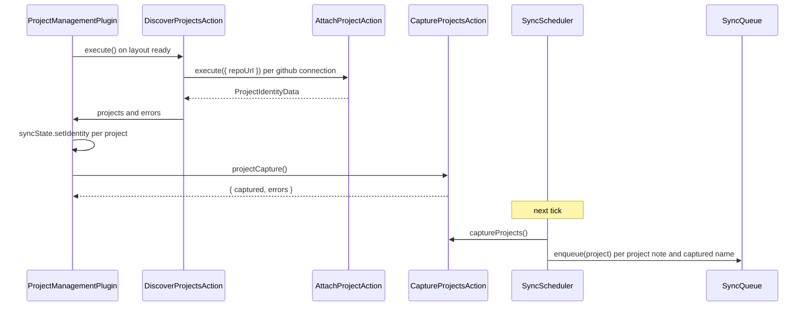

#### 2.1b The chain order

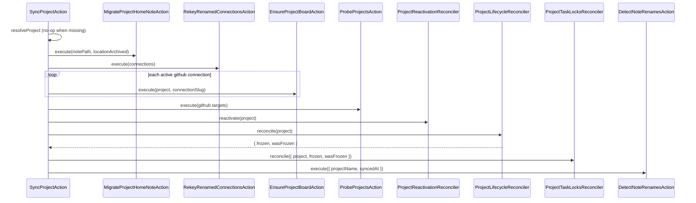

#### 2.1c The core reconcilers and the sweep

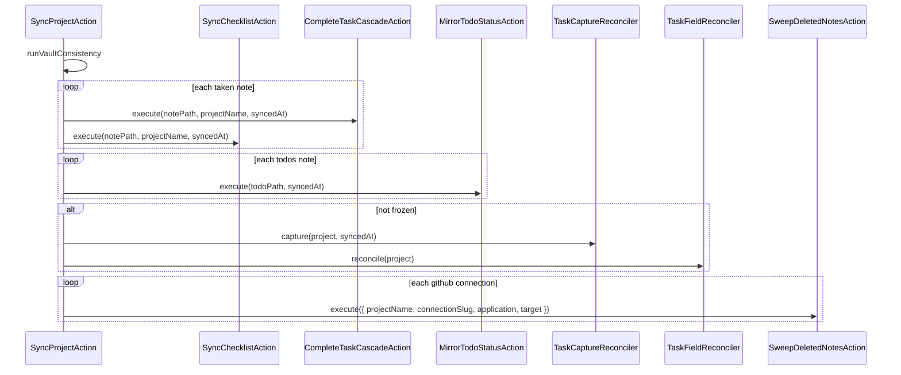

The five reconciler interfaces are the cutover seam: `SyncProjectAction` holds
a `() => TaskFieldReconciler` (and the four peers), and `main.ts` fills each
with an adapter over the assembled core action. The lifecycle reconciler returns
`{ frozen, wasFrozen }`; when it throws, `SyncProjectAction` falls back to the
probe's `closed` fact and `note.archivedAt`.

### 2.2 The N-way merge (`mergeField`)

`mergeField` is the whole decision: it derives one `Delta` per side against that
side's own `Baseline`, then applies the ladder. It is pure — no I/O, no clock,
no randomness. Its inputs are `SideObservation`s (one origin, N mirrors); its
output is a `MergeResult` carrying the outcome, the winning value, the rung, the
deltas and the superseded deltas.

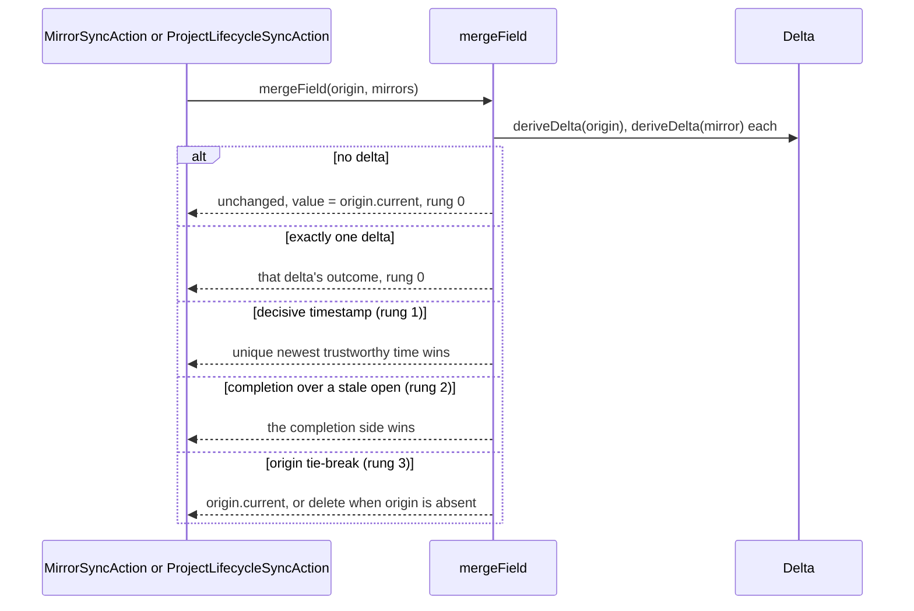

Delta derivation (see [§3](#3-the-decision-ladder) for the rules): an origin
whose `current` is `null` with a baseline is a **delete** delta; a mirror's
absence is a delete only when it has a baseline **and** its adapter declares
`complete-fetch` and `fetchComplete()` returned true.

### 2.3 The mirror-sync action (`MirrorSyncAction`)

`MirrorSyncAction` names no provider. Given a `MirrorSyncPass`, it filters the
mirrors to those whose descriptor `represents` the field, observes each against
its own baseline, calls `mergeField` once, fans the reconciled value out through
the one generic write entry, and applies the same value to the origin. It
records the sides written, skipped, advanced and failed on a `PassRecord`. A
mirror write that throws is recorded in `failed` and fan-out continues to the
remaining mirrors, so one failing connection never abandons the rest.

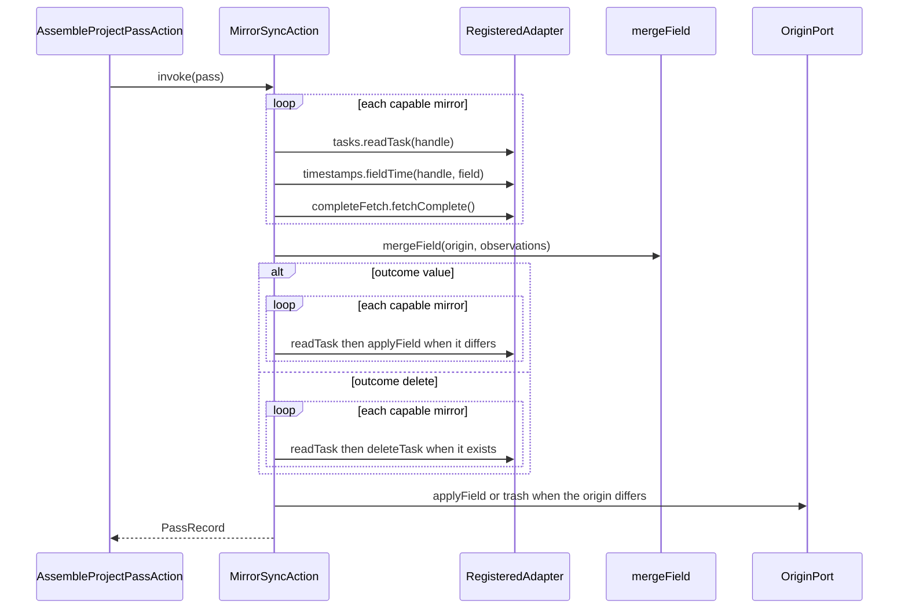

A side is **advanced** when it was written or already matched; a skipped write
still advances (the repair path for a widened value); a failed write advances
nothing.

### 2.4 The project pass assembler (`AssembleProjectPassAction`)

`AssembleProjectPassAction.invoke` reads the project's declared connections and
its task-note paths, builds one mirror adapter per connection through
`MirrorAdapterFactoryPort`, resolves each note to that connection's own handle
through `MirrorHandlePort`, and runs `MirrorSyncAction` once per
(note, canonical field) over the six merged fields — `title`, `body`,
`subtasks`, `completion`, `Status`, `label`. A connection whose entity has no
resolved handle is **materialized**: the origin task is read through
`OriginPort.readTask` (a note without a `type` is not a task and is skipped), a
placeholder handle is recorded through the mirror-handle port before the item is
created through `TaskSurfacePort.createTask`, the real handle replaces the
placeholder, and the created mirror is reconciled in the same pass. A
placeholder left by an interrupted pass is **adopted** by matching the mirror's
task title rather than re-created, so a failed record never duplicates the item.

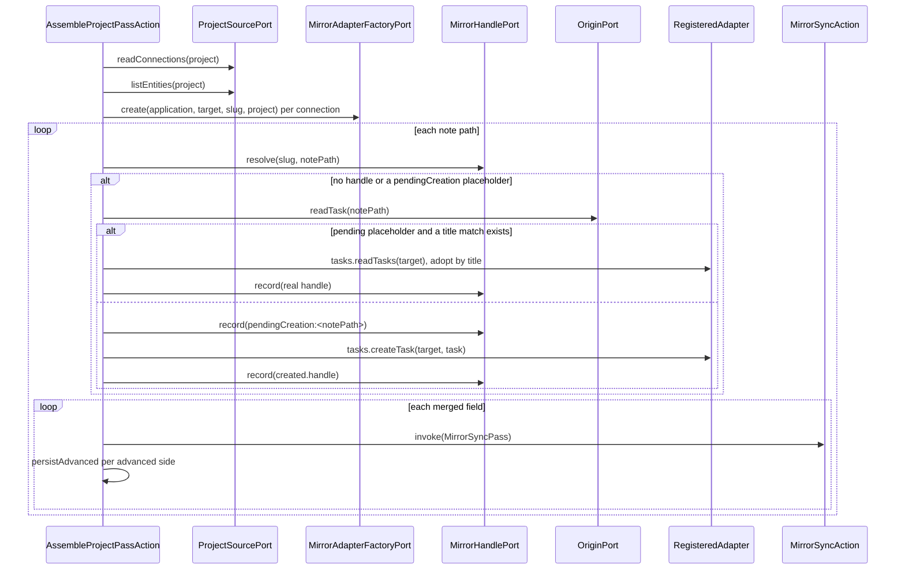

The side key is `mirror:<slug>` (`mirrorSideKey`), disjoint from the origin's
`origin` key, so a connection slug of `origin` cannot collide. Two connections
to the same application stay distinct sides. The pass persists each advanced
side's `Baseline` (value plus the completion flag) through `BaselineStorePort`.

### 2.5 The project lifecycle pass

`AssembleProjectLifecyclePassAction` is the project-level peer of the task pass.
It scopes the mirrors, resolves each connection's mirror project through
`MirrorProjectPort` — onboarding a missing one by `ProjectPort.createProject`
and recording the returned handle, so a newly-connected project is onboarded in
the same pass — renames a mirror project whose name drifted from the vault
project through `ProjectPort.renameProject`, reads the origin's archived state
through `ProjectLifecycleOriginPort`, runs the same `mergeField` ladder over the
archived fact, and fans the reconciled freeze out to the origin and every
capable mirror. Any side can start the freeze or the unfreeze; the reconciled
freeze is the pass's `frozen` verdict, which gates the task-field pass. Its
per-side baselines live under the `lifecycle` field in the same baseline store.

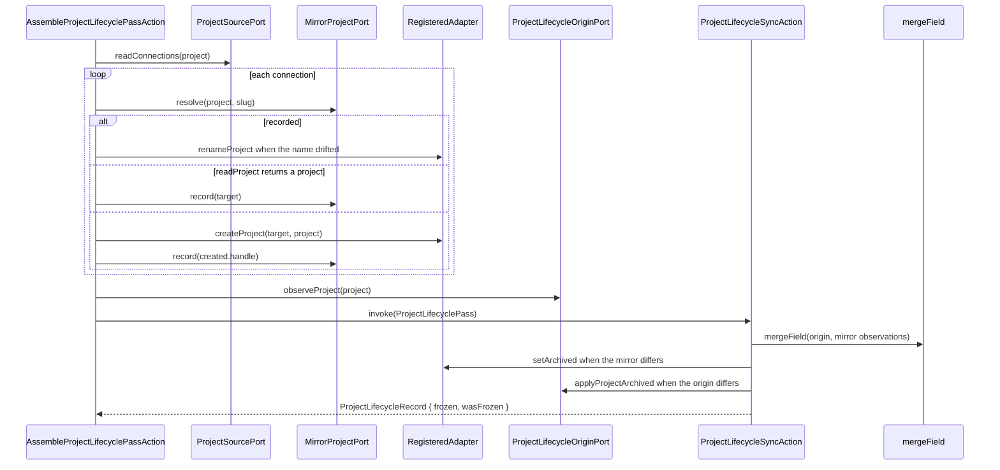

`wasFrozen` is `pass.origin.baseline?.value === 'true'`; `frozen` is
`result.value === 'true'`. A mirror that exposes no archive time returns `null`
from `archivedTime`, so the ladder falls through to the vault tie-break.

### 2.6 Project capture (`CaptureProjectsAction`)

A capture-capable adapter enumerates the application-born projects it can see
(`ProjectCapturePort.captureProjects`), each carrying its name, its candidate
connection targets and its creation clock. The action reads each source's
projects in creation order, adopts every project after that source's stored
cursor that the vault does not already declare — writing the home note with its
connection envelope through `ProjectCaptureVaultPort` — and advances the cursor
only over the projects it handled. A first sight adopts the newest clock and
captures nothing, so installing the plugin against an account full of unrelated
projects adopts none of them. A project that links zero or several targets stops
the watermark with a collected error; an already-declared project is skipped, so
the pass is idempotent.

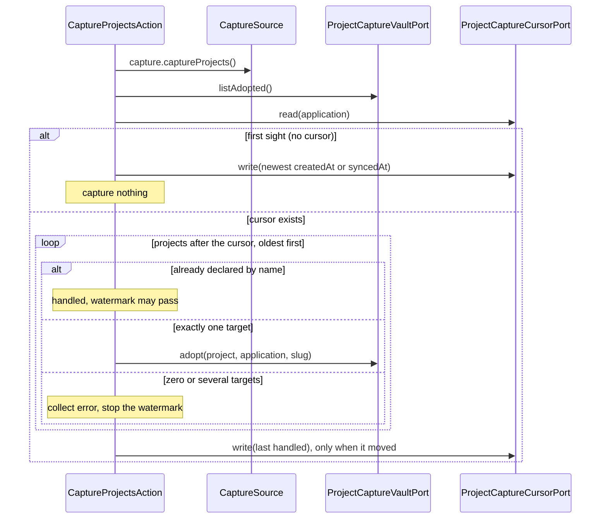

### 2.7 Task capture (`CaptureTasksAction`)

For each declared connection whose adapter declares `capture`, the core action
reads the tracked tasks the adapter can see (`CapturePort.capture`) — the issues
carrying a `type:` label — and adopts every task the vault does not already hold
as a task note. The whole listing is scanned each pass and the adopted mirror
items are skipped, so the pass is idempotent without a cursor. The vault sink
routes by the connection's application: a code-host issue through
`CreateTaskNoteAction`, a task-manager task through `CapturedTaskNoteMapper`. A
connection whose listing or adoption fails is collected and never stops the
later connections.

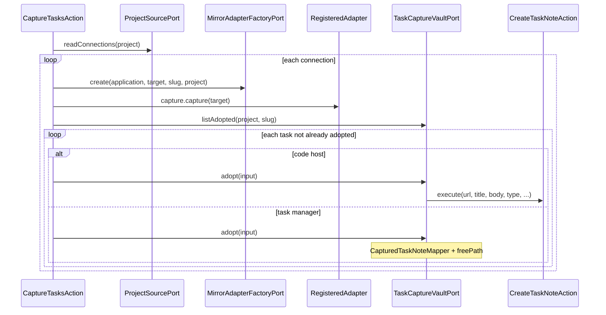

### 2.8 Task locks and reactivation

`ReconcileProjectTaskLocksAction` runs only on a freeze/unfreeze transition
(`frozen !== wasFrozen`). For each connection whose adapter declares
`task-locking`, it enumerates the project's tracked mirror items through
`MirrorHandlePort`, skips the tasks whose vault status is the done lane, and
locks the rest — or unlocks every tracked task on the unfreeze.

`ReactivateFrozenProjectAction` runs before the lifecycle pass. When the origin
was already frozen (its `lifecycle` baseline is `true`) and a capable mirror's
newest item provably postdates the stored watch cursor, it unfreezes the origin,
so the lifecycle pass fans the unfreeze out to every mirror. The first watch
adopts the newest item as the cursor; a quiet conditional read writes nothing.

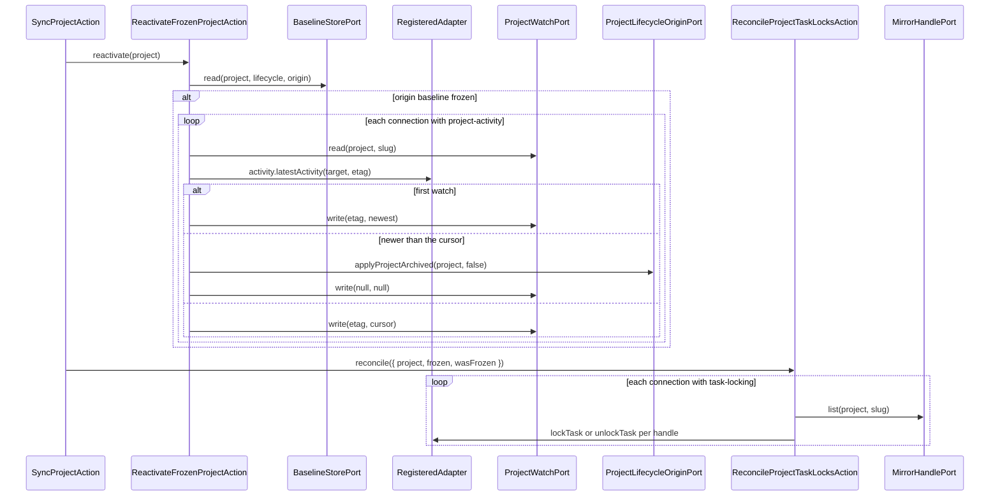

### 2.9 The registry

`SyncStateAdapter` is the single writer of the `syncState` container. Every port
method funnels through a promise-chain mutex, so a command racing a sync pass
cannot interleave a load-modify-save. The first load reads the `syncState`
container, builds the in-memory indexes, and caches it. Ports are keyed by the
note's connection slug (not the provider name), so a project can hold two
connections of the same tool; discovery re-keys a renamed connection's port in
lockstep (`rekeyPortState`). Identities are keyed per connection
(`projects.<name>.identities.<connectionSlug>`), so two code-host connections
address their own repositories and boards. The container also carries the
per-surface project-capture cursors (`projectCursors`) beside the projects;
setting a cursor to its current value is a no-op. Every write persists through a
fresh read of the `data.json` root (so settings keys survive) after asking for a
throttled rolling backup. A container whose version is NEWER than this plugin's
is loaded read-only: reads serve it, but every mutating port method throws
("registry written by a newer plugin version — refusing to mutate"). A corrupt
`data.json` is quarantined by `loadDataSafely` before the adapter ever sees it.
The settings save shares this one chain through `mutateRoot`.

The core's own memory lives in two sibling top-level keys, written through the
same storage but not through `SyncStateAdapter`:

- **`coreBaselines`** (`CoreBaselineStoreAdapter`) — per entity, per
  `BaselineField` (a canonical field or `lifecycle`), per side, a `Baseline`
  (`value`, `completed`).
- **`coreWatches`** (`CoreProjectWatchAdapter`) — per project, per connection,
  the reactivation watch (`etag`, `cursor`).

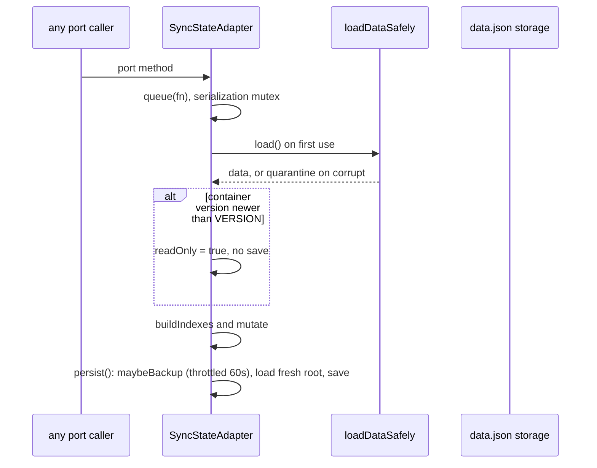

### 2.10 Settings save

Settings and the registry share `data.json` but are split so a settings save can
never revert the registry. At onload, `settingsFromData` copies the root and
deletes the `syncState` key, so the in-memory settings never carry a registry
snapshot. `saveSettings` calls `SyncStateAdapter.mutateRoot`, which runs on the
SAME promise chain as every registry write: it reads a fresh root, merges the
settings into it (`mergeSettingsIntoData` skips `syncState`), and persists.

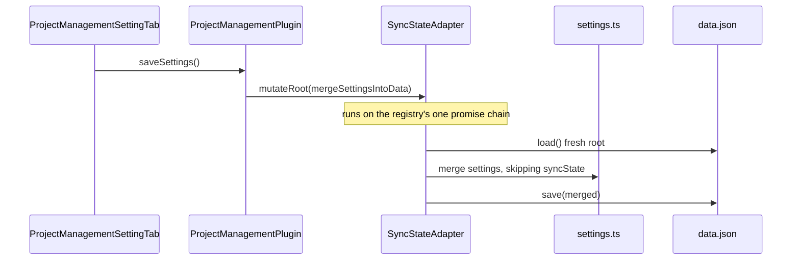

### 2.11 Registration

The composition root builds the descriptors and passes the registrations to the
pure registrar. `gateMirror` reuses the same registrar to gate a single adapter
for the factory.

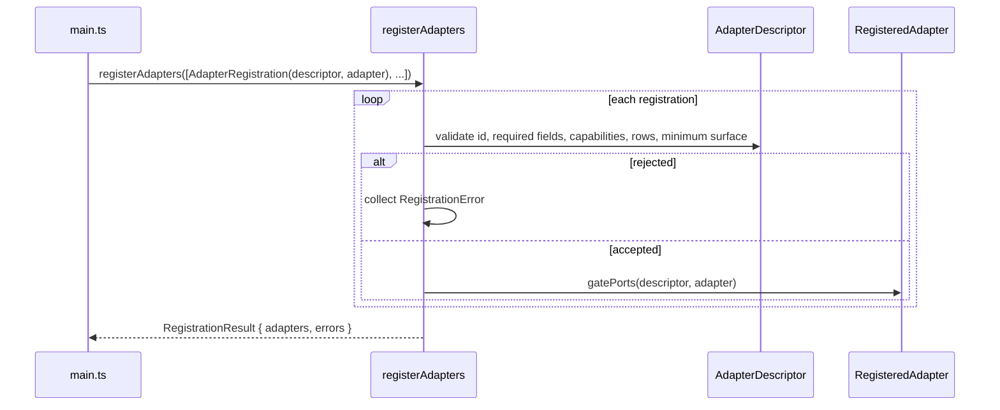

`mirrorAdapterFactory.create` dispatches on the application id to
`CodeHostMirrorAdapter` or `TaskManagerMirrorAdapter` and gates the result;
`buildCaptureSources` gates the same two adapters once and collects their
`projectCapture` surfaces.

### 2.12 Vault consistency (retained shell)

The chain's vault-consistency step keeps the markdown checklist and the vault
to-do notes in step. `SyncChecklistAction` promotes an unlinked line to a new
to-do note, relinks a short or wrong-folder link, renames a drifted to-do,
follows the checkbox, and trashes a to-do whose line was removed.
`MirrorTodoStatusAction` runs the other direction: a to-do note's status updates
its parent task's checkbox. Both settle, so a second pass writes nothing.

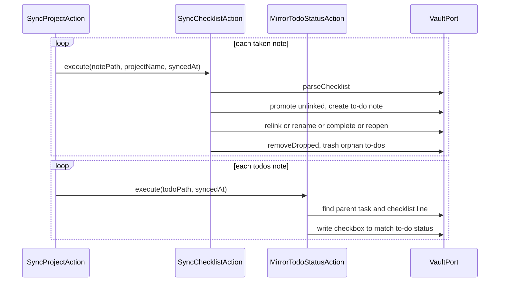

### 2.13 Completion and the cascade (retained shell)

Done is one fact with one stamp. The invariant is `status === doneLane` if and
only if `completedAt !== null`. `CompleteTaskCascadeAction` is the vault-side
projection: when a task's status is the done lane it checks the task note's own
checklist lines, completes every still-open to-do the task owns, and checks the
task's own line in a parent slice's checklist. Reopen is asymmetric: the parent
slice line mirrors the status in both directions, but the to-dos are never
auto-reopened. The core's `completion` field carries the same fact to the
mirrors through `MirrorSyncAction`.

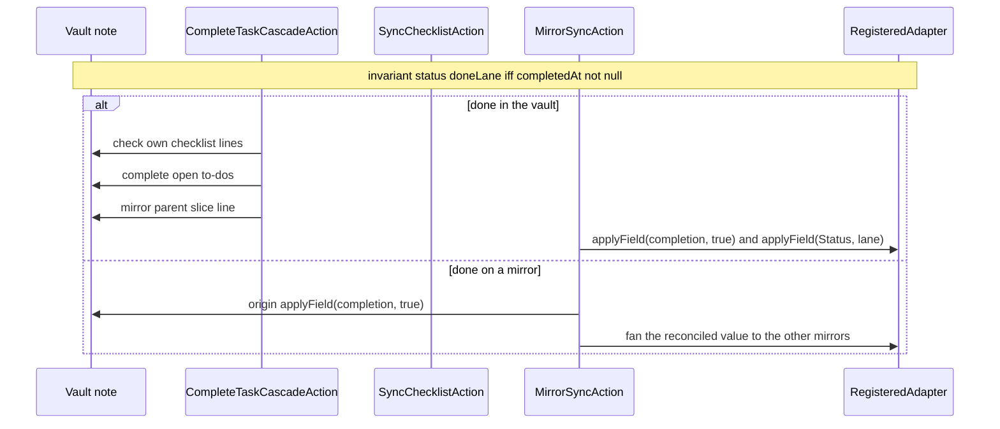

### 2.14 Deletion propagation (retained shell, factory-backed)

A deleted note is swept by `SweepDeletedNotesAction`, which enumerates the
project's entities and, for each whose note is gone, calls
`HandleDeletedNoteAction`. That action finds the registry record by note path,
resolves the connection's mirror item through `SyncStatePort`, builds the
connection's adapter through `MirrorAdapterFactoryPort`, and calls
`TaskSurfacePort.deleteTask` (the GitHub adapter deletes the board card). When
the stored base lane is not the done lane it then applies
`completion = true` through the generic write entry, which closes the issue.
Finally it evicts the entity, dropping its remaining mirror items. Deletion
starts in the vault; a remote deletion is never honored as a deletion of record.

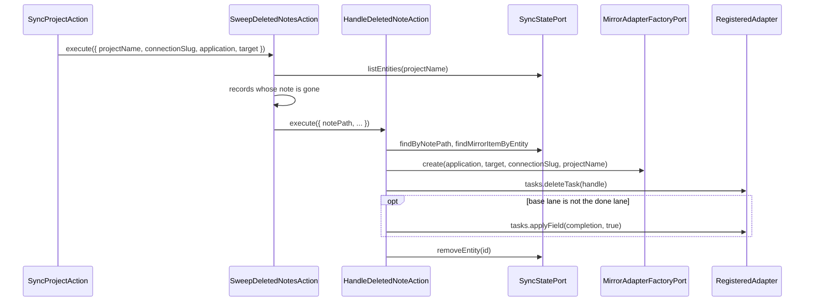

The reverse case: a twin deleted by hand whose note survives is not a deletion
of the note. The vault wins, and the projection recreates the twin in the same
tick.

### 2.15 Rename survival (retained shell)

A live rename event bypasses the debounce and enqueues the project immediately,
but the recovery itself is the same as an offline rename:
`DetectNoteRenamesAction` lists the current notes and the records, groups the
untracked notes by a recovery stem (the filename stem with a legacy ordinal
prefix stripped and lowercased, via `normalizedStem`), and moves each vanished
record's `notePath` to the same-stem note. The uuid and the mirrors are
untouched.

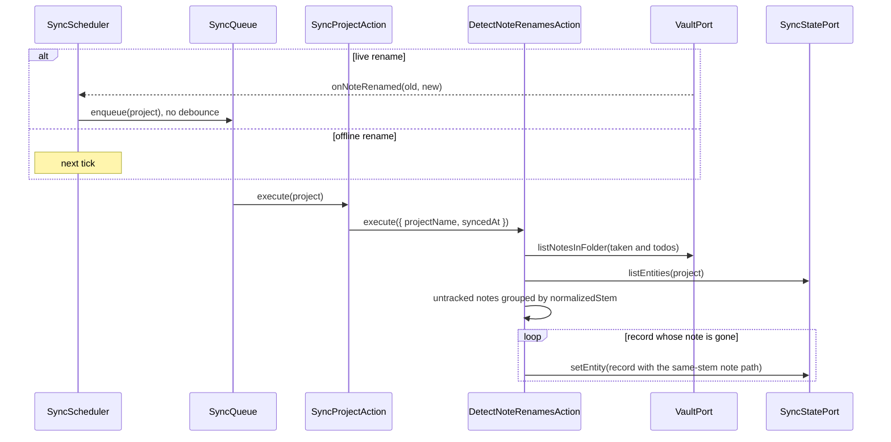

### 2.16 Discovery, attach and board-ensure (`ProjectSetupPort`)

At `onLayoutReady`, `DiscoverProjectsAction` enumerates the vault's project
notes and attaches each GitHub connection through `AttachProjectAction`, which
uses `ProjectSetupPort.discoverProjects` to resolve the repository and its
boards, `deriveBoardChoice` to pick one, and `readProjectAddressing` to resolve
the Status field and its options. A board that does not exist yet yields an
identity with an empty `projectNodeId`, which `EnsureProjectBoardAction`
resolves later on the chain: it adopts a linked board, prefers the one titled
with the repo name, creates one (with a Status field) when none exists, and
adopts an unlinked same-name viewer board (the orphan of an interrupted
creation) rather than duplicating it. The identities are persisted so later
board operations can resolve them.

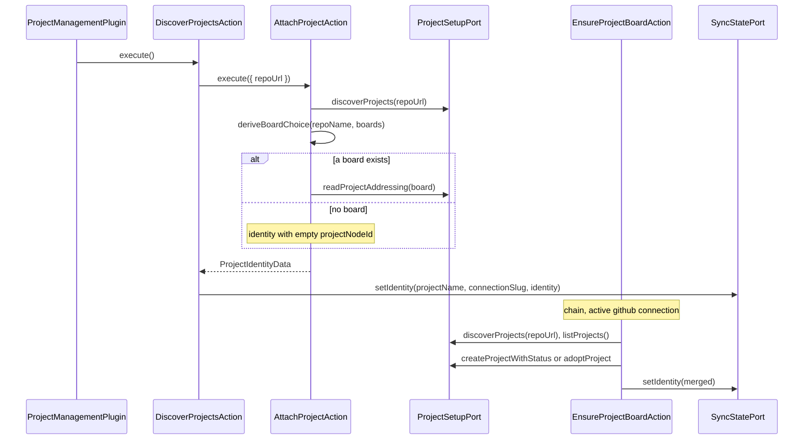

---

## 3. The decision ladder

`mergeField(origin, mirrors)` is pure: no I/O, no clock, no randomness. It runs
in two stages.

**Stage 1 — attribution (`deriveDelta`).** For each side, compare the side's
current canonical value with its own baseline:

- current equals baseline → no delta;
- current differs (or there is no baseline) → a `value` delta carrying the
  current value, the side's field time and whether it is completed;
- current is `null` with a baseline → a `delete` delta. The origin's absence is
  always a delete; a mirror's absence is a delete only when its adapter declares
  `complete-fetch` and `fetchComplete()` returned true (a verified-complete
  fetch), so an adapter that cannot prove a full listing never deletes on
  absence.

**Stage 2 — resolution.** With the deltas collected:

1. **No delta.** `unchanged`; the value is the origin's current value.
2. **Exactly one delta.** That delta wins at rung 0; its kind is the outcome.
3. **Rung 1 — decisive timestamp.** Consider only trustworthy deltas with a
   non-null time. The newest must be unique, and every other delta must be
   trustworthy, have a time, and be strictly older. Then the newest wins. A
   non-trustworthy or timeless side blocks the rung, so the ladder falls
   through.
4. **Rung 2 — completion over a stale open.** Among value deltas, if at least
   one is a completion and at least one is an open, there are no deletes, the
   origin is not itself an open delta, and all completions carry the same value,
   the completion wins. (The origin's own open state blocks the rung, so a
   completion never overrides a deliberate vault reopen.)
5. **Rung 3 — origin authority.** The origin wins. If the origin's current
   value is `null`, the outcome is `delete`; otherwise it is `value` with the
   origin's value. This is the fallback for every remaining multi-sided
   conflict, including both-done `Status` conflicts (which differ only in lane
   cosmetics).

The invariant: after `mergeField`, every multi-sided conflict has a winner, so
no field is left undecided. The collapsed outcome drives the fan-out; the
origin's absence is a delete delta, and the origin's edit time is trusted by
default (the origin side sets `timestampTrustworthy: true`).

The reopen veto the old pairwise verdict applied on the pull path is subsumed:
the GitHub adapter keeps the completion fact separate from the `Status`
representation, and `completion` is merged as its own field, so a stale board
lane can no longer revert a completion.

---

## 4. Invariants cheat-sheet

- **Base advances only after durable writes.** `MirrorSyncAction` records a
  side as advanced only after its write resolves (or when it already matched);
  `AssembleProjectPassAction.persistAdvanced` then writes the `Baseline`. A
  failed write is recorded in `failed` and advances nothing. A skipped write
  still advances: the side already matched the reconciled value, which is the
  repair path for a widened value.
- **A fact from one mirror never moves another's base.** Each side is compared
  against its own baseline; the reconciled value is fanned out to every capable
  mirror, and each side's baseline advances independently.
- **A mirror's absence is a delete only with a verified-complete fetch.** An
  adapter without `complete-fetch` (or whose `fetchComplete()` is false) never
  yields a delete from absence, so a partial listing cannot delete a mirror
  item.
- **The origin's absence is a delete.** The origin side always has
  `completeFetch: true`; a missing origin task with a baseline is a delete
  delta, and rung 3 produces `delete` when the origin is absent.
- **The origin's edit time is trusted by default.** `originSideObservation`
  sets `timestampTrustworthy` from the origin observation, which the vault
  adapters set to `true`.
- **Completion is sticky.** Rung 2 lets a completion beat a stale open, and
  rung 3 falls back to the origin, so an open origin is never overridden by a
  mirror's completion; a deliberate vault reopen holds.
- **The completion fact is separate from the Status representation.** The
  canonical `completion` field carries done-ness; `Status` carries the lane. A
  both-done conflict resolves by origin authority without collapsing the two.
- **Flatten before delete (retained shell).** A slice twin is retired by moving
  every direct child to the top level, awaiting the moves, and only then
  deleting the twin; a failed flatten aborts before the delete and retries next
  tick.
- **Registry writes are serialized.** Every `SyncStateAdapter` port method and
  the settings save run on one promise chain, so a load-modify-save can never
  interleave. A container written by a newer plugin version is read-only.
- **A quiet tick writes nothing.** Setting a project cursor to its current
  value is a no-op; a lifecycle or task side that already matches is advanced
  without a remote write.
- **The `coreBaselines` and `coreWatches` keys are siblings of `syncState`.**
  The core's memory is separate from the shell's per-mirror bases, so a write on
  one cannot clobber the other.

---

## 5. Code-vs-brief discrepancies

These are places where the code and the design brief (ADR 001) disagree. The
code is documented above; the brief's version is recorded here.

1. **The orchestration shell is retained, not fully replaced.** ADR 001 says the
   legacy halves, the old pure verdict and the legacy writers are deleted (they
   are), and describes the chain as running the core reconcilers. It does — but
   `SyncProjectAction` still orchestrates through the legacy `VaultPort` and
   `SyncStatePort`, still branches on `connection.tool === 'github'`, and still
   runs the board-ensure, probe, vault-consistency (cascade, checklist, to-do
   mirror) and deletion-sweep steps. The five core reconcilers are injected
   seams; the surrounding shell is legacy scaffolding. The ADR's "the chain
   builds the origin and the per-connection mirror adapters" is accurate, but the
   surrounding steps are not core.
2. **`HandleDeletedNoteAction` is the remaining old-port consumer.** It builds
   the connection's adapter through the core `MirrorAdapterFactoryPort` and
   writes through `TaskSurfacePort`, but it still finds the record and the
   mirror item through the legacy `SyncStatePort`. The ADR names it as the
   remaining old-port consumer; that is still true.
3. **The probe result is only a fallback.** `SyncProjectAction.probe` runs
   `ProbeProjectsAction` and passes the `ProjectStateData` into
   `reconcileLifecycle`, but the lifecycle reconciler ignores it; the probe's
   `closed` fact is used only when the lifecycle reconciler throws. The primary
   freeze verdict comes from the core lifecycle pass.
4. **`identity` is declared but not reconciled by the task pass.** The
   `identity` canonical field and capability exist, and `MirrorSyncAction`'s
   `canonicalValue` supports it, but `AssembleProjectPassAction` merges only
   `title`, `body`, `subtasks`, `completion`, `Status` and `label`. Identity is
   carried by the registry's mirror items, not merged as a field.
5. **The scheduler's pre-tick capture is injected, not owned.** `SyncScheduler`
   invokes an optional `captureProjects` callback and enqueues its returned
   names; `main.ts` wires that callback to `projectCapture()`. The scheduler
   itself makes no decision about what the capture does.

---

## 6. Where to start reading

The tree is module-first; each module owns one surface of the system.

- The wiring and construction order: `src/main.ts` (`onload`, `composePlugin`,
  `composeCoreReconcilers`, `mirrorAdapterFactory`).
- The core engine: `src/core/` (`mergeField`, `MirrorSyncAction`,
  `AssembleProjectPassAction`, `AssembleProjectLifecyclePassAction`,
  `ProjectLifecycleSyncAction`, `registerAdapters`, `AdapterDescriptor`, the
  ports under `src/core/ports/`, the DTOs under `src/core/data/`).
- The capture and lifecycle reconcilers: `src/core/CaptureProjectsAction.ts`,
  `CaptureTasksAction.ts`, `ReconcileProjectTaskLocksAction.ts`,
  `ReactivateFrozenProjectAction.ts`.
- The driven adapters: `src/infrastructure/` (`vault/`, `github/`, `todoist/`,
  `registry/`, `fake/`).
- The chain and the shell: `src/sync/` (`SyncProjectAction`,
  `ProbeProjectsAction`, `DetectNoteRenamesAction`, `SweepDeletedNotesAction`,
  `HandleDeletedNoteAction`, the five reconciler interfaces).
- The registry: `src/registry/` (`SyncStateAdapter`, `SyncStateSchema`,
  `loadDataSafely`).
- The projects module: `src/projects/` (`DiscoverProjectsAction`,
  `AttachProjectAction`, `EnsureProjectBoardAction`, `deriveBoardChoice`,
  `MigrateProjectHomeNoteAction`, `RekeyRenamedConnectionsAction`).
- The vault: `src/vault/` (`VaultAdapter`, `ToDoNoteMapper`/`ToDoNoteParser`);
  the task-note codecs live with their consumers
  (`src/core/TaskNoteMapper.ts`, `src/infrastructure/vault/CapturedTaskNoteMapper.ts`).
- The driving side: `src/app/` (`SyncScheduler`, `SyncQueue`, the settings
  module, `SeedVaultArtifactsAction`).
