# obsidian-project-management — Developer Manual

This manual walks every path through the source on branch `main`.
It is written against the code, not against the design brief: where the two
disagree, the code is described and the disagreement is called out in
[Code-vs-brief discrepancies](#5-code-vs-brief-discrepancies).

The manual is self-contained: it states the behavioral contract — the
capabilities (DISC…PRB) and the five core promises the plugin must keep — and
records the decision log (dt-01…dt-23), the design decisions the code
implements. Scenario and decision identifiers are cited per flow so every
described behavior can be traced.

---

## 1. Orientation

### What the plugin is

The vault is the origin of truth. A project is a folder under `Projecten/`
(or `Archief/` when archived) whose home note declares a non-empty
`connections` map — one entry per tool, `{ tool, project }`; a task is a note
under its `taken/` folder; a to-do is a note under its `todos/` folder. GitHub
(a repository plus a Projects v2 board) and Todoist are **mirrors**: they hold
copies of the vault's title, body, status and completion, and the plugin keeps
them honest. Identity is a vault-owned uuid held in the registry (`data.json`'s
`syncState` container); filenames and frontmatter carry no machine id.

### The five core promises

1. **The vault is the origin of truth.** A note wins over a remote unless the
   remote provably changed more recently.
2. **No change is ever lost, and none is invented.** Every edit lands
   everywhere it should; nothing appears that nobody asked for.
3. **Deletion is deliberate and thorough.** Deleting a note removes its echoes
   everywhere. Deleting a twin on a remote never touches the note.
4. **Completion is sticky.** A completed task stays completed unless a person
   deliberately reopens it.
5. **Interruption is safe.** A stop at any moment recovers on the next start
   without losing or duplicating work.

### The cast

The core talks to infrastructure through four provider-neutral ports, all owned
by the shared kernel (`src/shared/`) and implemented by an adapter registered
from the adapter's own module:

- **ProjectManagementPort** — the code host: identity resolution, project
  detail (issues + board cards in one fetch), viewer boards, issue creation,
  board status/membership, project open/close.
- **TaskManagerPort** — the task manager: projects, sections, tasks, completion,
  labels.
- **VaultPort** — the vault: notes, folders, events.
- **SyncStatePort** — the registry: entities, mirror items, port state,
  identities, watch state and the project-capture cursors.

The actions and infrastructure:

- **SyncScheduler** — delivery mechanics only. A poll interval and vault
  change/delete/rename events enqueue project names; renames bypass the
  debounce. Before each tick it runs the remote-project capture, so a project
  born on a remote is captured before the per-project chain reads it. It makes
  no business decisions.
- **SyncQueue** — one serialized promise chain for the whole plugin. Runs one
  project at a time, coalesces duplicates, swallows a failed run so the queue
  never poisons.
- **SyncProjectAction** — the chain. One work item (a project folder name) and
  one entry point; composes the halves and isolates each step.
- **SyncGithubTasksAction** — the GitHub half. Probe gate (including the outward
  drift gate), one whole-project fetch, per-issue three-way diff, verdict
  application, interrupted-creation healing, and outward materialization
  (registry-first).
- **SyncTodoistTasksAction** — the Todoist half. Absorbers first, then the
  two-phase twin projection, then deletion propagation.
- **ApplyTaskToVaultAction** — the vault writer. Renders a winning task onto
  its note, creates the note when absent, updates the registry.
- **ApplyTaskToGithubAction** — the GitHub writer. Renders a winning task onto
  its issue and board card, then advances the github base.
- **ApplyTaskToTodoistAction** — the Todoist writer. Renders a winning task or
  to-do onto its twin, writing only differing fields, then advances the
  todoist base.
- **ApplyTodoistRemoteChangesAction** — absorber. Applies Todoist content,
  lane and parent changes into the vault; self-heals a hand-deleted twin.
- **ApplyTodoistCompletionAction** — absorber. Pulls Todoist completions and
  reopens into the vault; owns the completed-since cursor.
- **CaptureTodoistCreationsAction** — absorber. Captures hand-made Todoist
  items into the vault as notes.
- **CaptureRemoteProjectsAction** — captures remote-born PROJECTS into the
  vault (PRJ-2 task manager, PRJ-3 code host), guarded by a per-surface
  creation-clock cursor.
- **EnsureProjectBoardAction** — creates (or adopts) the code-host board for a
  vault-born project (PRJ-1).
- **MigrateProjectConnectionsAction** — on load, rewrites a project note's
  legacy `pm`/`url`/`board`/`todoist` frontmatter into the `connections` map
  (github from `url`, todoist from `todoist`), stripping all four in one save.
- **ReconcileProjectLifecycleAction** — one freeze verdict across folder,
  board and Todoist project; the archive stamp and the reactivation watch.
- **ProjectMapper** — the pure boundary mapping of provider project payloads
  onto canonical `ProjectData`; `RemoteProjectData` is the neutral task-manager
  project DTO.
- **CompleteTaskCascadeAction** — the dt-13 cascade. A done task checks its
  checklist lines, completes its open to-dos, and mirrors its line in a parent
  slice; reopen is asymmetric.
- **VerdictResolver** — the decision ladder, pure. Per-field three-way diff
  plus conflict resolution.
- **toDiffView** — the comparable form of a task: body replaced by its digest.
  All diffing and base storage operate on diff views.
- **SyncStateAdapter** — the registry. Project-nested, port-grouped storage
  with in-memory indexes, a serialization mutex shared with the settings save,
  a migration chain, a rolling backup and a read-only guard for a container
  written by a newer plugin version.
- **GitHubAdapter / TodoistAdapter / VaultAdapter** — the infrastructure
  implementations of `ProjectManagementPort`, `TaskManagerPort` and `VaultPort`.
- **CleanupNoteFrontmatterAction** — strips legacy `id:`/`url:`/`todoist:`
  frontmatter from task and to-do notes at chain start.
- **DetectNoteRenamesAction** — recovers a rename the plugin did not observe
  by pairing a vanished record with a same-stem note.
- **HandleDeletedNoteAction** — a deleted note's GitHub side: remove the card,
  close the issue, evict the record.
- **PropagateTodoistDeletionsAction** — a deleted note's Todoist side: delete
  the twin (and its subtree) and evict the records.
- **ProbeProjectsAction** — one cheap query for every project's `updatedAt`
  and `closed`, so the expensive fetch can be gated.
- **EnsureTodoistSectionsAction** — one Todoist section per board lane,
  created on demand, renamed in place on a lane rename.
- **SyncChecklistAction** — keeps a task note's markdown checklist and its
  vault to-do notes in step (promote, relink, rename, complete, trash).
- **MirrorTodoStatusAction** — a to-do note's status flows back to its parent
  task's checkbox.
- **RelinkRenamedTodoAction** — a hand-renamed to-do's checklist line and
  registry record follow.
- **RelocateTaskStatusAction** — a hand-renamed task's registry record follows.
- **PropagateStatusAction** — a note's status onto its issue state and board
  card, with the base lane refreshed.
- **BoardStatusAction** — a note's status onto the board's Status column,
  gated on the base lane.
- **PromoteIssueAction / PromoteCardAction** — the explicit user escape hatch
  past the type-label gate.

---

## 2. Sequence diagrams

Each diagram names the real classes and follows the actual call graph. A
one-paragraph summary and the scenario IDs precede each.

### 2.1 The pass

On load, `MigrateProjectConnectionsAction` rewrites the legacy project
frontmatter to the connection envelope before discovery reads any note.
`SyncScheduler.tick` first runs `CaptureRemoteProjectsAction` (remote-born
projects into the vault, PRJ-2/PRJ-3), then enumerates the vault's project
notes and enqueues each project name; `SyncQueue` runs them one at a time.
`SyncProjectAction.execute` re-resolves the project (a stale work item no-ops),
strips legacy frontmatter, ensures the code-host board exists for an active
project (PRJ-1), probes the project's remote state, reconciles the lifecycle
into one freeze verdict, recovers renames, runs the GitHub half (gated by the
probe, the `fullScanPending` marker and the outward drift gate), runs the
vault-consistency step, runs the Todoist half (gated by the freeze verdict and
a resolved Todoist project id), and finally sweeps deletions. Every step is
wrapped in `step()`, so one failure logs and skips that step without blocking
the others. Implements DISC-1, DISC-3, PRJ-1, PRJ-2, PRJ-3, PRB-1, PRB-2,
PRB-3, SYNC-8.

#### 2.1a The capture pre-tick and the resolve

```mermaid
sequenceDiagram
  participant Sched as SyncScheduler
  participant Cap as CaptureRemoteProjectsAction
  participant V as VaultPort
  participant SS as SyncStatePort
  participant Q as SyncQueue
  participant SP as SyncProjectAction

  Sched->>Cap: execute(syncedAt)
  Cap->>V: findProjectNotes() for the vault-links dedup
  Cap->>SS: getProjectCursor then setProjectCursor per surface
  Note over Cap: only projects after the cursor; a skip stops the watermark
  Sched->>V: findProjectNotes()
  Sched->>Q: enqueue(projectName) per note
  Q->>SP: execute(project)
  SP->>V: findProjectNotes() to resolve
  alt project note missing
    SP-->>Q: no-op
  end
```

#### 2.1b The chain, project setup

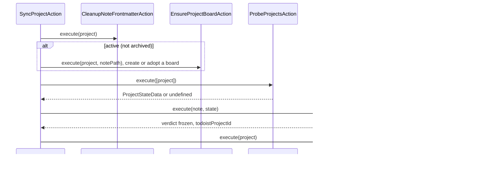
```mermaid
sequenceDiagram
  participant SP as SyncProjectAction
  participant Clean as CleanupNoteFrontmatterAction
  participant Ens as EnsureProjectBoardAction
  participant Probe as ProbeProjectsAction
  participant Life as ReconcileProjectLifecycleAction
  participant Ren as DetectNoteRenamesAction

  SP->>Clean: execute(project)
  alt active (not archived)
    SP->>Ens: execute(project, notePath), create or adopt a board
  end
  SP->>Probe: execute([project])
  Probe-->>SP: ProjectStateData or undefined
  SP->>Life: execute(note, state)
  Life-->>SP: verdict frozen, todoistProjectId
  SP->>Ren: execute(project)
```

#### 2.1c The chain, halves and sweep

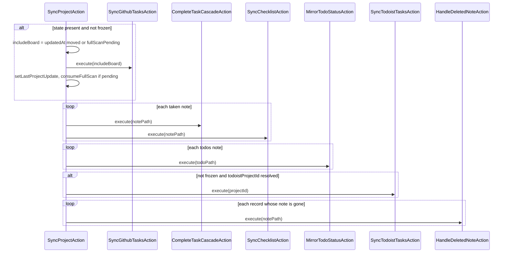
```mermaid
sequenceDiagram
  participant SP as SyncProjectAction
  participant GH as SyncGithubTasksAction
  participant Cas as CompleteTaskCascadeAction
  participant Chk as SyncChecklistAction
  participant Mir as MirrorTodoStatusAction
  participant TD as SyncTodoistTasksAction
  participant Del as HandleDeletedNoteAction

  alt state present and not frozen
    SP->>SP: includeBoard = updatedAt moved or fullScanPending
    SP->>GH: execute(includeBoard)
    SP->>SP: setLastProjectUpdate, consumeFullScan if pending
  end
  loop each taken note
    SP->>Cas: execute(notePath)
    SP->>Chk: execute(notePath)
  end
  loop each todos note
    SP->>Mir: execute(todoPath)
  end
  alt not frozen and todoistProjectId resolved
    SP->>TD: execute(projectId)
  end
  loop each record whose note is gone
    SP->>Del: execute(notePath)
  end
```

### 2.2 The GitHub half, per issue

`SyncGithubTasksAction.execute` resolves the project identity, applies the
probe gate (skip when the board is unmoved **and** the vault has no drift
**and** there is no outward drift), fetches the whole project in one GraphQL
query, heals any interrupted outward creation, and iterates the typed issues.
An issue with no registry record is adopted (materialized) unless it is
closed. A tracked issue is diffed: the vault live view, the remote live view
and the mirror's base are composed, `VerdictResolver.diff` attributes each
field, `resolveConflicts` arbitrates, and the collapsed verdict drives the
writers. A push renders the vault onto GitHub; a pull renders the remote onto
the vault, unless the reopen veto fires (a done note whose issue is closed but
whose card lane is stale). The base advances inside the writer, after the
durable writes. Finally, the outward phase materializes every typed vault-born
task note that has no issue (see 2.4). Implements MAT-1, MAT-3, SYNC-1, SYNC-2,
SYNC-3, SYNC-5, SYNC-6, SYNC-7, SUB-1, SUB-5, OFF-1, OFF-2, OFF-3.

#### 2.2a Gate, fetch and record resolution

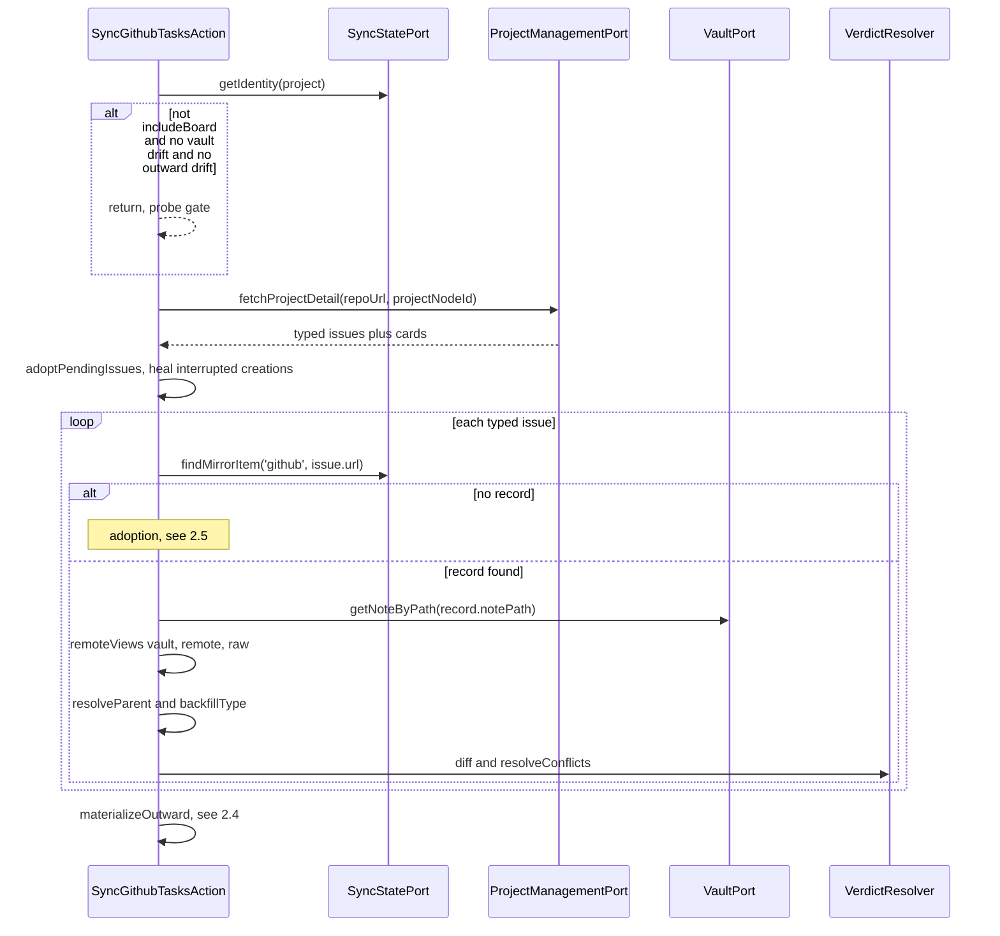
```mermaid
sequenceDiagram
  participant GH as SyncGithubTasksAction
  participant SS as SyncStatePort
  participant PM as ProjectManagementPort
  participant V as VaultPort
  participant VR as VerdictResolver

  GH->>SS: getIdentity(project)
  alt not includeBoard and no vault drift and no outward drift
    GH-->>GH: return, probe gate
  end
  GH->>PM: fetchProjectDetail(repoUrl, projectNodeId)
  PM-->>GH: typed issues plus cards
  GH->>GH: adoptPendingIssues, heal interrupted creations
  loop each typed issue
    GH->>SS: findMirrorItem('github', issue.url)
    alt no record
      Note over GH: adoption, see 2.5
    else record found
      GH->>V: getNoteByPath(record.notePath)
      GH->>GH: remoteViews vault, remote, raw
      GH->>GH: resolveParent and backfillType
      GH->>VR: diff and resolveConflicts
    end
  end
  GH->>GH: materializeOutward, see 2.4
```

#### 2.2b Verdict application

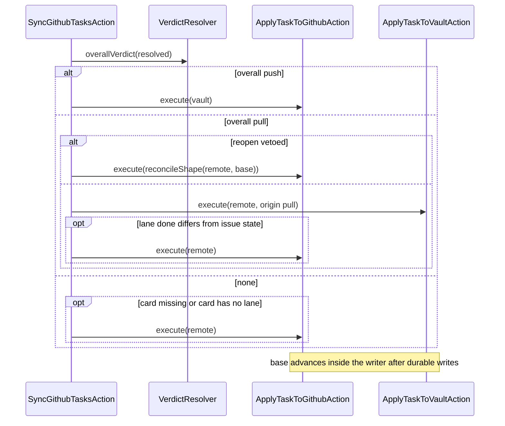
```mermaid
sequenceDiagram
  participant GH as SyncGithubTasksAction
  participant VR as VerdictResolver
  participant WGH as ApplyTaskToGithubAction
  participant WV as ApplyTaskToVaultAction

  GH->>VR: overallVerdict(resolved)
  alt overall push
    GH->>WGH: execute(vault)
  else overall pull
    alt reopen vetoed
      GH->>WGH: execute(reconcileShape(remote, base))
    else
      GH->>WV: execute(remote, origin pull)
      opt lane done differs from issue state
        GH->>WGH: execute(remote)
      end
    end
  else none
    opt card missing or card has no lane
      GH->>WGH: execute(remote)
    end
  end
  Note over WGH,WV: base advances inside the writer after durable writes
```

### 2.3 The Todoist half

`SyncTodoistTasksAction.execute` runs the absorbers first (remote changes,
then capture, then completion), fetches the active set once, projects the
tracked tasks in two phases, projects the to-dos, and propagates deletions.
The absorbers are split into their own diagram because the half is long.
Implements MAT-1, MAT-2, MAT-4, TODO-1, TODO-3, SLI-1, SLI-2, SLI-3, SUB-2,
SUB-3, SUB-4, LANE-1, LANE-2, LANE-3, DEL-1, DEL-3.

#### 2.3a The absorbers

`ApplyTodoistRemoteChangesAction` fetches the completed-since window and the
active set, joins the registry's todoist items to their entities, and applies
content/lane/parent verdicts into the vault. A twin absent from both sets
whose note survives is a hand deletion: the record is evicted so the
projection recreates the twin (vault wins). `CaptureTodoistCreationsAction`
captures unanchored items as notes, parents before children.
`ApplyTodoistCompletionAction` pulls completions into the done lane and
reopens, then advances the poll cursor. Implements MAT-4, SYNC-2, SYNC-4,
COM-3, TODO-2, LANE-2, DEL-2.

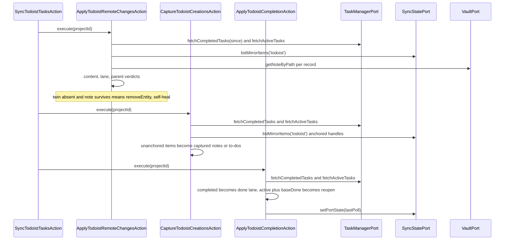
```mermaid
sequenceDiagram
  participant TD as SyncTodoistTasksAction
  participant RC as ApplyTodoistRemoteChangesAction
  participant Cap as CaptureTodoistCreationsAction
  participant Comp as ApplyTodoistCompletionAction
  participant TM as TaskManagerPort
  participant SS as SyncStatePort
  participant V as VaultPort

  TD->>RC: execute(projectId)
  RC->>TM: fetchCompletedTasks(since) and fetchActiveTasks
  RC->>SS: listMirrorItems('todoist')
  RC->>V: getNoteByPath per record
  RC->>RC: content, lane, parent verdicts
  Note over RC: twin absent and note survives means removeEntity, self-heal
  TD->>Cap: execute(projectId)
  Cap->>TM: fetchCompletedTasks and fetchActiveTasks
  Cap->>SS: listMirrorItems('todoist') anchored handles
  Cap->>Cap: unanchored items become captured notes or to-dos
  TD->>Comp: execute(projectId)
  Comp->>TM: fetchCompletedTasks and fetchActiveTasks
  Comp->>Comp: completed becomes done lane, active plus baseDone becomes reopen
  Comp->>SS: setPortState(lastPoll)
```

#### 2.3b The projection

`projectTasks` ensures the lane sections, fetches the tracked issues, builds
one `ProjectionItem` per tracked note, retires any slice twin (flattening its
children first), resolves each item's nearest materialized ancestor, and
projects top-level twins in phase A before nested twins in phase B. `projectToDos`
then hangs each to-do off the pass's twin plan. `propagateTodoistDeletions`
runs last. Implements MAT-1, MAT-2, TODO-1, TODO-3, SLI-1, SLI-2, SLI-3,
SUB-2, SUB-3, SUB-4, LANE-1, LANE-2, LANE-3.

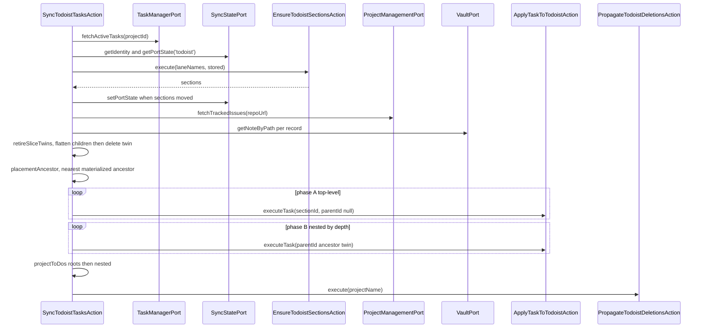
```mermaid
sequenceDiagram
  participant TD as SyncTodoistTasksAction
  participant TM as TaskManagerPort
  participant SS as SyncStatePort
  participant ES as EnsureTodoistSectionsAction
  participant PM as ProjectManagementPort
  participant V as VaultPort
  participant W as ApplyTaskToTodoistAction
  participant PD as PropagateTodoistDeletionsAction

  TD->>TM: fetchActiveTasks(projectId)
  TD->>SS: getIdentity and getPortState('todoist')
  TD->>ES: execute(laneNames, stored)
  ES-->>TD: sections
  TD->>SS: setPortState when sections moved
  TD->>PM: fetchTrackedIssues(repoUrl)
  TD->>V: getNoteByPath per record
  TD->>TD: retireSliceTwins, flatten children then delete twin
  TD->>TD: placementAncestor, nearest materialized ancestor
  loop phase A top-level
    TD->>W: executeTask(sectionId, parentId null)
  end
  loop phase B nested by depth
    TD->>W: executeTask(parentId ancestor twin)
  end
  TD->>TD: projectToDos roots then nested
  TD->>PD: execute(projectName)
```

### 2.4 Outward materialization (vault → GitHub)

A new task note (type `task`, `chore`, `bug` or `slice`) under `taken/` is born
in the vault and materialized OUTWARD: the GitHub half creates an issue, adds a
board card in the note's lane, and links all three in the registry. The ordering
is registry-first, and that is the safety property: the entity and a
placeholder mirror item are written BEFORE the remote call, so a crash can never
orphan an issue that the next pass would materialize as a second note and a
second issue (promise 5, promise 2).

The probe gate opens for outward drift: a typed `taken/` note with no REAL
github mirror re-opens the fetch even when the board is quiet (`hasOutwardDrift`,
and the gate's quiet-tick guarantee, SYNC-8). The half then runs the per-issue
loop first (existing mirrors settle), heals any interrupted creation
(`adoptPendingIssues`), and finally creates the issue for each remaining typed
note (`materializeOutward`). The note's lane is validated against the board's
options BEFORE the issue is created, so an unmappable lane is logged and skipped
rather than creating an issue whose card can never be placed.

The phase is idempotent across passes:

- placeholder and the issue exists → the issue's handle is adopted (no duplicate
  issue, no duplicate note);
- placeholder and the issue is absent → the creation is retried (the placeholder
  prevents the duplicate-note path);
- a real mirror exists → the note is left to the per-issue loop.

The placeholder handle is the entity-unique marker `pendingCreation:<uuid>`; it
can never collide with an issue url and several interrupted creations coexist.
Implements MAT-1, MAT-2, SYNC-8, promise 5.

#### 2.4a Registry-first outward creation and the reconcile

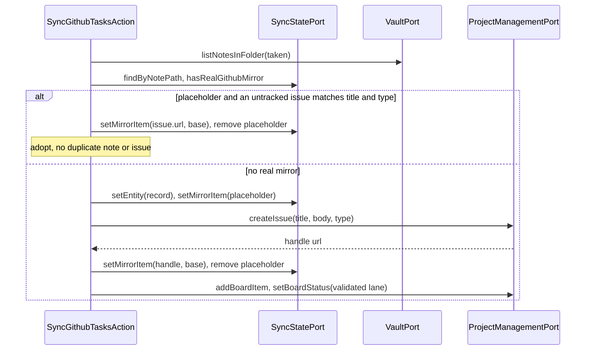
```mermaid
sequenceDiagram
  participant GH as SyncGithubTasksAction
  participant SS as SyncStatePort
  participant V as VaultPort
  participant PM as ProjectManagementPort

  GH->>V: listNotesInFolder(taken)
  GH->>SS: findByNotePath, hasRealGithubMirror
  alt placeholder and an untracked issue matches title and type
    GH->>SS: setMirrorItem(issue.url, base), remove placeholder
    Note over GH: adopt, no duplicate note or issue
  else no real mirror
    GH->>SS: setEntity(record), setMirrorItem(placeholder)
    GH->>PM: createIssue(title, body, type)
    PM-->>GH: handle url
    GH->>SS: setMirrorItem(handle, base), remove placeholder
    GH->>PM: addBoardItem, setBoardStatus(validated lane)
  end
```

#### 2.4b Note creation from adoption or promotion

The other note-creation path is `CreateTaskNoteAction`, driven from the GitHub
side (adoption, see 2.5) and from promotion (see 2.13), never from a bare vault
note. It mints the uuid, renders the template through `TaskNoteMapper`, resolves
a free path (slug plus ordinal), writes the note and the registry record.

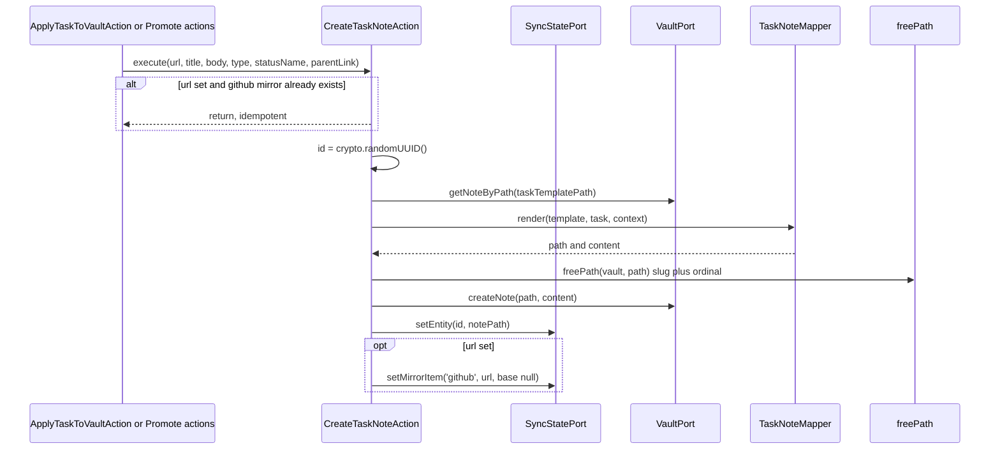
```mermaid
sequenceDiagram
  participant Caller as ApplyTaskToVaultAction or Promote actions
  participant C as CreateTaskNoteAction
  participant SS as SyncStatePort
  participant V as VaultPort
  participant M as TaskNoteMapper
  participant FP as freePath

  Caller->>C: execute(url, title, body, type, statusName, parentLink)
  alt url set and github mirror already exists
    C-->>Caller: return, idempotent
  end
  C->>C: id = crypto.randomUUID()
  C->>V: getNoteByPath(taskTemplatePath)
  C->>M: render(template, task, context)
  M-->>C: path and content
  C->>FP: freePath(vault, path) slug plus ordinal
  C->>V: createNote(path, content)
  C->>SS: setEntity(id, notePath)
  opt url set
    C->>SS: setMirrorItem('github', url, base null)
  end
```

### 2.5 Adoption from GitHub

An untracked typed issue is adopted: a note is materialized, its affiliation
is seeded from a tracked parent (the sub-issue case), the registry record and
mirror items are written, and the card is added if missing. A closed untracked
issue is skipped. Implements MAT-3, MAT-5, SUB-1, SUB-5.

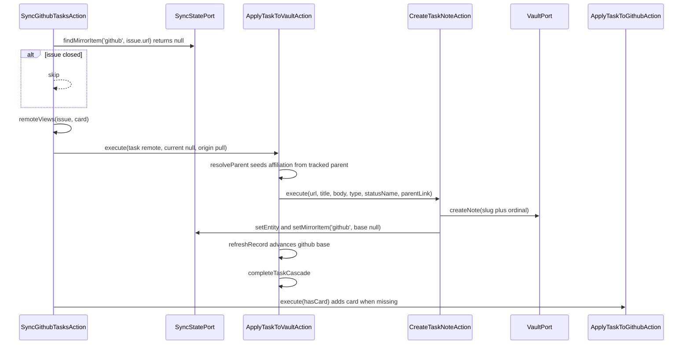
```mermaid
sequenceDiagram
  participant GH as SyncGithubTasksAction
  participant SS as SyncStatePort
  participant WV as ApplyTaskToVaultAction
  participant C as CreateTaskNoteAction
  participant V as VaultPort
  participant WGH as ApplyTaskToGithubAction

  GH->>SS: findMirrorItem('github', issue.url) returns null
  alt issue closed
    GH-->>GH: skip
  end
  GH->>GH: remoteViews(issue, card)
  GH->>WV: execute(task remote, current null, origin pull)
  WV->>WV: resolveParent seeds affiliation from tracked parent
  WV->>C: execute(url, title, body, type, statusName, parentLink)
  C->>V: createNote(slug plus ordinal)
  C->>SS: setEntity and setMirrorItem('github', base null)
  WV->>WV: refreshRecord advances github base
  WV->>WV: completeTaskCascade
  GH->>WGH: execute(hasCard) adds card when missing
```

### 2.6 Capture from Todoist

A hand-made Todoist item with no anchored record is captured. Its kind follows
its position: top-level becomes a captured task note affiliated to the
project; under a slice twin becomes a captured task note affiliated to the
slice; under a task twin becomes a to-do note linked from that task's
checklist; under a to-do twin becomes a nested to-do. Parents are captured
before children. Implements MAT-4, MAT-5, TODO-1, SUB-2.

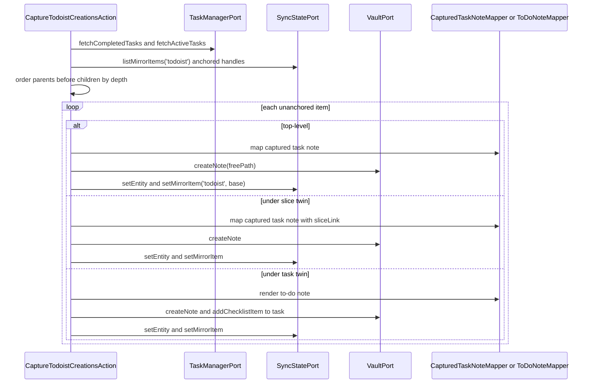
```mermaid
sequenceDiagram
  participant Cap as CaptureTodoistCreationsAction
  participant TM as TaskManagerPort
  participant SS as SyncStatePort
  participant V as VaultPort
  participant M as CapturedTaskNoteMapper or ToDoNoteMapper

  Cap->>TM: fetchCompletedTasks and fetchActiveTasks
  Cap->>SS: listMirrorItems('todoist') anchored handles
  Cap->>Cap: order parents before children by depth
  loop each unanchored item
    alt top-level
      Cap->>M: map captured task note
      Cap->>V: createNote(freePath)
      Cap->>SS: setEntity and setMirrorItem('todoist', base)
    else under slice twin
      Cap->>M: map captured task note with sliceLink
      Cap->>V: createNote
      Cap->>SS: setEntity and setMirrorItem
    else under task twin
      Cap->>M: render to-do note
      Cap->>V: createNote and addChecklistItem to task
      Cap->>SS: setEntity and setMirrorItem
    end
  end
```

### 2.7 Completion and the cascade

Done is one fact with one stamp. The invariant is
`status === doneLane` if and only if `completedAt !== null`. A vault-side done
flows out through the GitHub writer (close issue, move card) and the Todoist
writer (complete twin), and the cascade checks the checklist lines, completes
the open to-dos and mirrors the parent slice line. A GitHub-side done is
pulled into the note and fans out. A Todoist-side done is pulled into the note
by the completion absorber and reaches GitHub on the next tick (the absorber
uses `origin: 'push'`, so it deliberately does not advance the github base).
Reopen is asymmetric: the parent slice line unchecks, but to-dos stay
completed. Implements COM-1, COM-2, COM-3, COM-4, SYNC-4, SYNC-5, TODO-2.

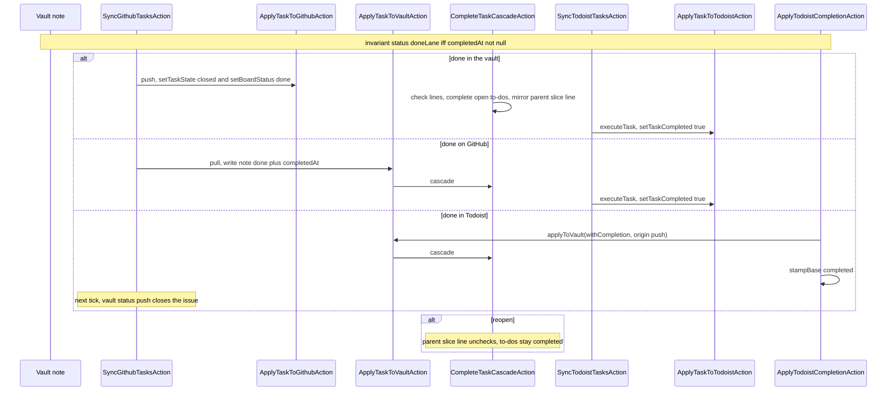
```mermaid
sequenceDiagram
  participant V as Vault note
  participant GH as SyncGithubTasksAction
  participant WGH as ApplyTaskToGithubAction
  participant WV as ApplyTaskToVaultAction
  participant Cas as CompleteTaskCascadeAction
  participant TD as SyncTodoistTasksAction
  participant WTD as ApplyTaskToTodoistAction
  participant Comp as ApplyTodoistCompletionAction

  Note over V,Comp: invariant status doneLane iff completedAt not null
  alt done in the vault
    GH->>WGH: push, setTaskState closed and setBoardStatus done
    Cas->>Cas: check lines, complete open to-dos, mirror parent slice line
    TD->>WTD: executeTask, setTaskCompleted true
  else done on GitHub
    GH->>WV: pull, write note done plus completedAt
    WV->>Cas: cascade
    TD->>WTD: executeTask, setTaskCompleted true
  else done in Todoist
    Comp->>WV: applyToVault(withCompletion, origin push)
    WV->>Cas: cascade
    Comp->>Comp: stampBase completed
    Note over GH: next tick, vault status push closes the issue
  end
  alt reopen
    Note over Cas: parent slice line unchecks, to-dos stay completed
  end
```

### 2.8 Deletion propagation

A deleted note is swept in two places. The Todoist half's
`PropagateTodoistDeletionsAction` deletes the twin of every record whose note
is gone (the API cascades the parent deletion to subtasks) and evicts the
records, except entities that still carry a github mirror, whose eviction is
deferred to the chain's deletion sweep. The chain's `HandleDeletedNoteAction`
then removes the card, closes the issue (unless the base lane is already the
done lane) and evicts the record, which drops its remaining mirror items.
Implements DEL-1, DEL-3.

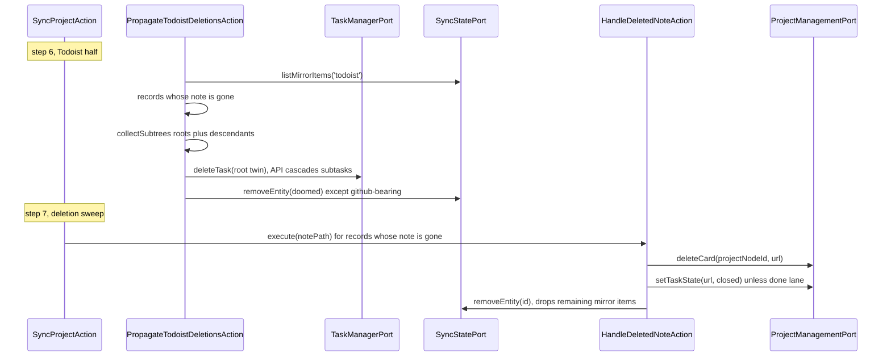
```mermaid
sequenceDiagram
  participant SP as SyncProjectAction
  participant PD as PropagateTodoistDeletionsAction
  participant TM as TaskManagerPort
  participant SS as SyncStatePort
  participant HD as HandleDeletedNoteAction
  participant PM as ProjectManagementPort

  Note over SP: step 6, Todoist half
  PD->>SS: listMirrorItems('todoist')
  PD->>PD: records whose note is gone
  PD->>PD: collectSubtrees roots plus descendants
  PD->>TM: deleteTask(root twin), API cascades subtasks
  PD->>SS: removeEntity(doomed) except github-bearing
  Note over SP: step 7, deletion sweep
  SP->>HD: execute(notePath) for records whose note is gone
  HD->>PM: deleteCard(projectNodeId, url)
  HD->>PM: setTaskState(url, closed) unless done lane
  HD->>SS: removeEntity(id), drops remaining mirror items
```

The reverse case is scenario DEL-2, and the code matches it: a twin deleted by
hand does **not** remove the note or the issue. `ApplyTodoistRemoteChangesAction`
treats a twin that is absent from both the active set and the completed window,
while its note survives, as a hand deletion of the twin: it evicts the record so
the projection recreates the twin in the same tick (the vault wins). Deletion
starts in the vault; a remote deletion is never honored as a deletion of record
(promise 3).

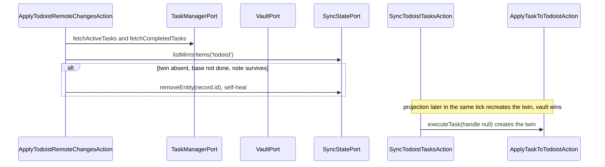
```mermaid
sequenceDiagram
  participant RC as ApplyTodoistRemoteChangesAction
  participant TM as TaskManagerPort
  participant V as VaultPort
  participant SS as SyncStatePort
  participant TD as SyncTodoistTasksAction
  participant W as ApplyTaskToTodoistAction

  RC->>TM: fetchActiveTasks and fetchCompletedTasks
  RC->>SS: listMirrorItems('todoist')
  alt twin absent, base not done, note survives
    RC->>SS: removeEntity(record.id), self-heal
  end
  Note over TD,W: projection later in the same tick recreates the twin, vault wins
  TD->>W: executeTask(handle null) creates the twin
```

### 2.9 Project lifecycle: archive freeze and capture

`ReconcileProjectLifecycleAction` is the one freeze verdict. It migrates the
home note to `_<project>.md`, resolves or creates the Todoist project and
stamps its anchor, then merges the folder position, the board's closed state
and the Todoist project's archived state. The vault folder is checked first,
so the vault wins a multi-sided move. A genuine active-to-archived transition
locks every unshipped issue and stamps `archivedAt`; a frozen project is still
watched through a conditional newest-issue read, and a newer issue reactivates
it. Implements ARC-1, ARC-2, ARC-3, ARC-4, ARC-5, DISC-2, ATT-3.

The other direction — a project born on a remote — is captured into the vault by
`CaptureRemoteProjectsAction` (PRJ-2 task manager, PRJ-3 code host), documented
in 2.9c. Capture runs before the per-project chain (the scheduler's pre-tick and
once after discovery), so a captured project's folder exists before its chain
pass runs.

#### 2.9a Resolve the project and the verdict

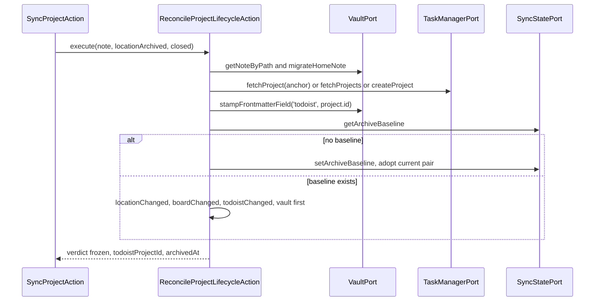
```mermaid
sequenceDiagram
  participant SP as SyncProjectAction
  participant Life as ReconcileProjectLifecycleAction
  participant V as VaultPort
  participant TM as TaskManagerPort
  participant SS as SyncStatePort

  SP->>Life: execute(note, locationArchived, closed)
  Life->>V: getNoteByPath and migrateHomeNote
  Life->>TM: fetchProject(anchor) or fetchProjects or createProject
  Life->>V: stampFrontmatterField('todoist', project.id)
  Life->>SS: getArchiveBaseline
  alt no baseline
    Life->>SS: setArchiveBaseline, adopt current pair
  else baseline exists
    Life->>Life: locationChanged, boardChanged, todoistChanged, vault first
  end
  Life-->>SP: verdict frozen, todoistProjectId, archivedAt
```

#### 2.9b Apply the freeze and watch

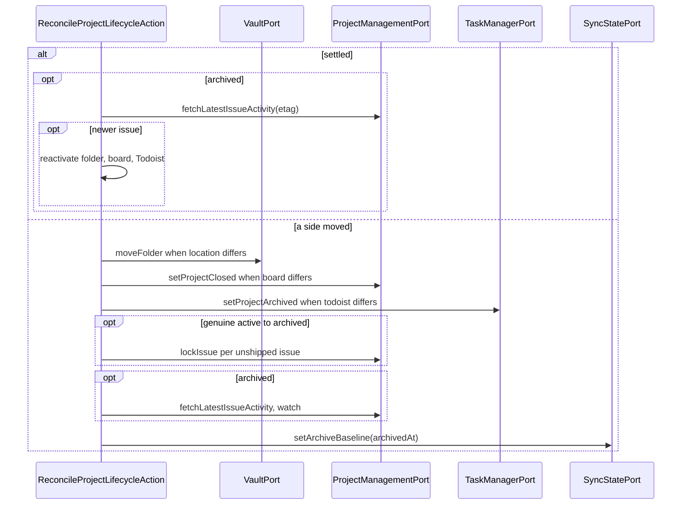
```mermaid
sequenceDiagram
  participant Life as ReconcileProjectLifecycleAction
  participant V as VaultPort
  participant PM as ProjectManagementPort
  participant TM as TaskManagerPort
  participant SS as SyncStatePort

  alt settled
    opt archived
      Life->>PM: fetchLatestIssueActivity(etag)
      opt newer issue
        Life->>Life: reactivate folder, board, Todoist
      end
    end
  else a side moved
    Life->>V: moveFolder when location differs
    Life->>PM: setProjectClosed when board differs
    Life->>TM: setProjectArchived when todoist differs
    opt genuine active to archived
      Life->>PM: lockIssue per unshipped issue
    end
    opt archived
      Life->>PM: fetchLatestIssueActivity, watch
    end
    Life->>SS: setArchiveBaseline(archivedAt)
  end
```

#### 2.9c Project capture (PRJ-2 / PRJ-3)

`CaptureRemoteProjectsAction` captures projects born on either remote into the
vault. Each surface keeps its own cursor: the newest provider creation clock
seen at the last poll. A project at or before the cursor is pre-existing and is
never adopted; a first sight (no cursor) adopts the current newest clock and
captures nothing, so installing the plugin against an account full of unrelated
projects adopts none of them. The capture materializes a `Projecten/<name>/`
folder with a `_<name>.md` home note carrying the birth surface's anchor, plus a
registry identity; the normal lifecycle then materializes the other surfaces.

The cursor is a watermark over handled projects, walked in creation order: it
advances only over projects actually processed. A post-cursor project that
could not be captured (a board whose identity cannot be resolved, a home note
the discovery scan did not see) stops the watermark, so the next pass retries
it; a project already linked to a vault home is handled and the watermark may
pass it. A skipped project is never reported as captured. A cursor that does not
move is not written (the adapter and the call site both guard), so a quiet tick
performs zero registry writes (SYNC-8). Implements PRJ-2, PRJ-3.

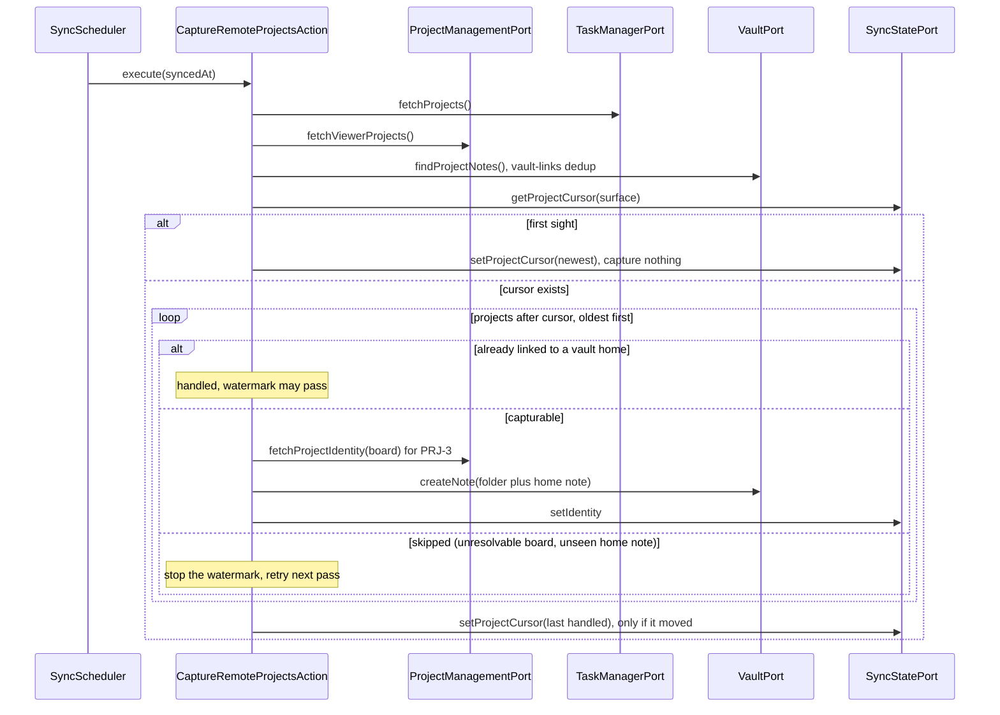
```mermaid
sequenceDiagram
  participant Sched as SyncScheduler
  participant Cap as CaptureRemoteProjectsAction
  participant PM as ProjectManagementPort
  participant TM as TaskManagerPort
  participant V as VaultPort
  participant SS as SyncStatePort

  Sched->>Cap: execute(syncedAt)
  Cap->>TM: fetchProjects()
  Cap->>PM: fetchViewerProjects()
  Cap->>V: findProjectNotes(), vault-links dedup
  Cap->>SS: getProjectCursor(surface)
  alt first sight
    Cap->>SS: setProjectCursor(newest), capture nothing
  else cursor exists
    loop projects after cursor, oldest first
      alt already linked to a vault home
        Note over Cap: handled, watermark may pass
      else capturable
        Cap->>PM: fetchProjectIdentity(board) for PRJ-3
        Cap->>V: createNote(folder plus home note)
        Cap->>SS: setIdentity
      else skipped (unresolvable board, unseen home note)
        Note over Cap: stop the watermark, retry next pass
      end
    end
    Cap->>SS: setProjectCursor(last handled), only if it moved
  end
```

### 2.10 Rename survival

A live rename event bypasses the debounce and enqueues the project
immediately, but the recovery itself is the same as an offline rename:
`DetectNoteRenamesAction` lists the current notes and the records, groups the
untracked notes by a recovery stem (the filename stem with a legacy ordinal
prefix stripped and lowercased), and moves each vanished record's `notePath`
to the same-stem note. The uuid and the mirrors are untouched. Implements
REN-1, REN-2, REN-3.

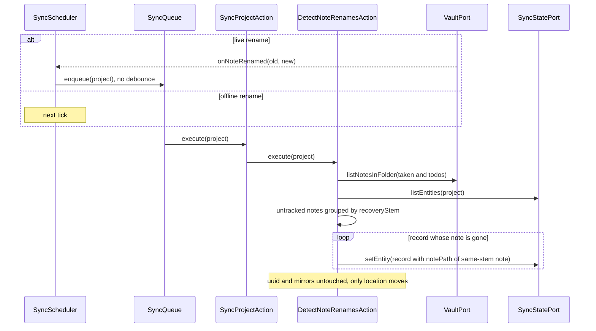
```mermaid
sequenceDiagram
  participant Sched as SyncScheduler
  participant Q as SyncQueue
  participant SP as SyncProjectAction
  participant Ren as DetectNoteRenamesAction
  participant V as VaultPort
  participant SS as SyncStatePort

  alt live rename
    V-->>Sched: onNoteRenamed(old, new)
    Sched->>Q: enqueue(project), no debounce
  else offline rename
    Note over Sched: next tick
  end
  Q->>SP: execute(project)
  SP->>Ren: execute(project)
  Ren->>V: listNotesInFolder(taken and todos)
  Ren->>SS: listEntities(project)
  Ren->>Ren: untracked notes grouped by recoveryStem
  loop record whose note is gone
    Ren->>SS: setEntity(record with notePath of same-stem note)
  end
  Note over Ren: uuid and mirrors untouched, only location moves
```

`RelocateTaskStatusAction` and `RelinkRenamedTodoAction` are **not** called
from the live vault rename event. They are called only from
`ApplyTodoistRemoteChangesAction.renameNote`, when a Todoist content change
renames the note. See
[Code-vs-brief discrepancies](#5-code-vs-brief-discrepancies).

### 2.11 The registry

`SyncStateAdapter` is the single writer. Every port method funnels through a
promise-chain mutex, so a command racing a sync pass cannot interleave a
load-modify-save. The first load runs the one-shot migration chain (legacy
flat root into the `syncState` container, then the v2 entity registry, then
the v3 project-nested port-grouped layout, then the per-project full-scan
seed), builds the in-memory indexes, and caches the container. Ports are keyed
by the note's connection slug (not the provider name), so a project can hold
two connections of the same tool; discovery re-keys a renamed connection's
port in lockstep (`rekeyPortState`), and a slug that disappears with no
matching connection is left in place with a collected warning. The container
also carries the per-surface project-capture cursors (`projectCursors`, keyed
by `todoist`/`github`) beside the projects; setting a cursor to its current
value is a no-op, so a quiet tick writes nothing (SYNC-8). Every write persists
through a fresh read of the data.json root (so settings keys survive) after
asking for a throttled rolling backup. A container whose version is NEWER than
this plugin's is loaded read-only: reads serve it, but every mutating port
method throws ("registry written by a newer plugin version — refusing to
mutate"), so a downgrade can never rewrite the newer schema in the old shape.
A corrupt data.json is quarantined by `loadDataSafely` before the adapter ever
sees it. The settings save shares this one chain through `mutateRoot` (see
2.12). Implements REG-1, REG-2, REG-4, REG-5, REG-6, SYNC-8, PRB-3.

#### 2.11a Load, the version guard and the migration chain

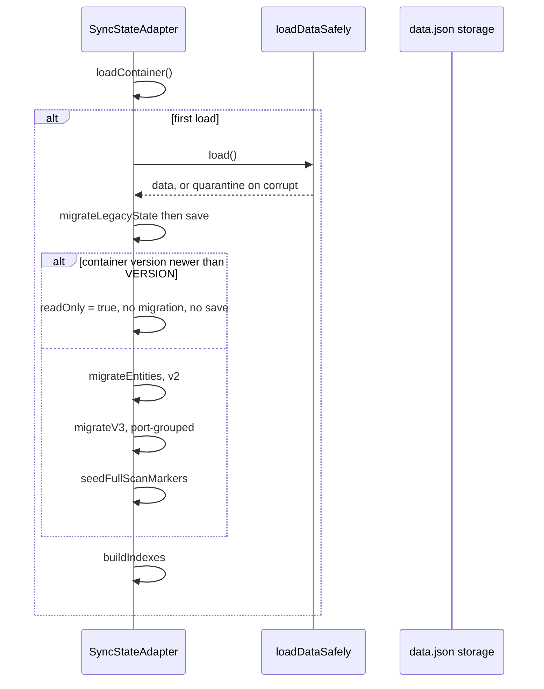
```mermaid
sequenceDiagram
  participant A as SyncStateAdapter
  participant L as loadDataSafely
  participant S as data.json storage

  A->>A: loadContainer()
  alt first load
    A->>L: load()
    L-->>A: data, or quarantine on corrupt
    A->>A: migrateLegacyState then save
    alt container version newer than VERSION
      A->>A: readOnly = true, no migration, no save
    else
      A->>A: migrateEntities, v2
      A->>A: migrateV3, port-grouped
      A->>A: seedFullScanMarkers
    end
    A->>A: buildIndexes
  end
```

#### 2.11b The mutex and the persist

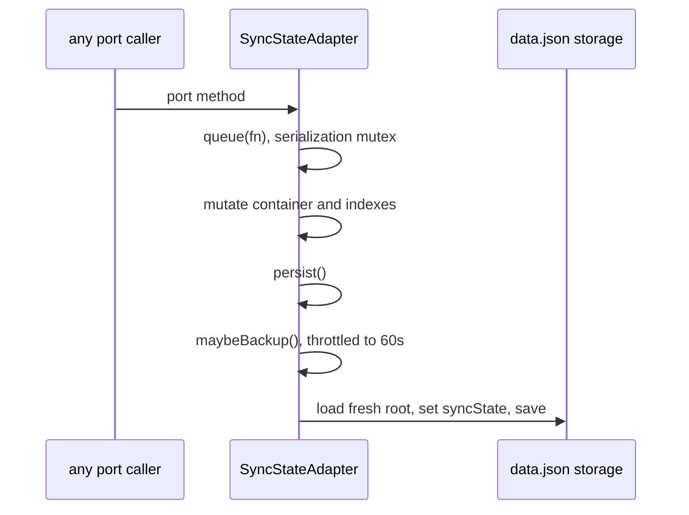
```mermaid
sequenceDiagram
  participant Caller as any port caller
  participant A as SyncStateAdapter
  participant S as data.json storage

  Caller->>A: port method
  A->>A: queue(fn), serialization mutex
  A->>A: mutate container and indexes
  A->>A: persist()
  A->>A: maybeBackup(), throttled to 60s
  A->>S: load fresh root, set syncState, save
```

### 2.12 Settings save

Settings and the registry share `data.json` but are split so a settings save
can never revert the registry. At onload, `settingsFromData` copies the root
and deletes the `syncState` key, so the in-memory settings never carry a
registry snapshot. `saveSettings` calls `SyncStateAdapter.mutateRoot`, which
runs on the SAME promise chain as every registry write: it reads a fresh root,
merges the settings into it (skipping `syncState`), and persists. A concurrent
settings save and registry persist can therefore neither interleave nor lose a
write (REG-2/REG-3). Implements REG-2, REG-3.

```mermaid
sequenceDiagram
  participant Tab as PluginSettingTab
  participant P as ProjectManagementPlugin
  participant A as SyncStateAdapter
  participant S as settings.ts
  participant D as data.json

  Tab->>P: saveSettings()
  P->>A: mutateRoot(merge)
  Note over A: runs on the registry's one promise chain
  A->>D: load() fresh root
  A->>S: mergeSettingsIntoData(root, settings)
  Note over S: skips SYNC_STATE_KEY, registry comes from the fresh read
  S-->>A: merged
  A->>D: save(merged)
  Note over P: settingsFromData deleted SYNC_STATE_KEY at onload
```

### 2.13 Promotion (added flow)

The type label is the adoption gate; promotion is the explicit user override.
`PromoteToTaskCommand` opens `PromoteModal`, which lists unpromoted issues
across the discovered projects; `PromoteIssueAction` applies the type label,
fetches the issue and materializes the note immediately.
`PromoteCardToIssueCommand` opens `PromoteCardModal`, which lists draft cards;
`PromoteCardAction` converts the draft to an issue and materializes the note.
Implements PRO-1, PRO-2, PRO-3.

```mermaid
sequenceDiagram
  participant Cmd as PromoteToTaskCommand or PromoteCardToIssueCommand
  participant Modal as PromoteModal or PromoteCardModal
  participant Act as PromoteIssueAction or PromoteCardAction
  participant PM as ProjectManagementPort
  participant SS as SyncStatePort
  participant C as CreateTaskNoteAction

  Cmd->>Modal: open()
  Modal->>PM: fetchUnpromotedIssues or fetchBoardItems
  Modal->>Act: execute(chosen)
  alt issue
    Act->>PM: addLabel(url, 'type: task')
    Act->>PM: fetchTask(url)
  else card
    Act->>PM: promoteCard(itemId, repoNodeId)
  end
  Act->>SS: getIdentity(project)
  Act->>C: execute(type from label, default lane)
  C->>SS: setEntity and setMirrorItem('github')
```

### 2.14 Vault consistency (added flow)

The chain's vault-consistency step keeps the markdown checklist and the vault
to-do notes in step. `SyncChecklistAction` promotes an unlinked line to a new
to-do note, relinks a short or wrong-folder link, renames a drifted to-do,
follows the checkbox, and trashes a to-do whose line was removed.
`MirrorTodoStatusAction` runs the other direction: a to-do note's status
updates its parent task's checkbox. Both settle, so a second pass writes
nothing. Implements TODO-1, TODO-2, TODO-4.

```mermaid
sequenceDiagram
  participant SP as SyncProjectAction
  participant Chk as SyncChecklistAction
  participant Mir as MirrorTodoStatusAction
  participant V as VaultPort

  loop each taken note
    SP->>Chk: execute(notePath)
    Chk->>V: parseChecklist
    Chk->>V: promote unlinked, create to-do note
    Chk->>V: mirror linked, rename or complete or reopen
    Chk->>V: removeDropped, trash orphan to-dos
  end
  loop each todos note
    SP->>Mir: execute(todoPath)
    Mir->>V: find parent task and checklist line
    Mir->>V: write checkbox to match to-do status
  end
```

### 2.15 Discovery, attach and capture (added flow)

At `onLayoutReady`, `DiscoverProjectsAction` enumerates the vault's project
notes and attaches each GitHub one through `AttachProjectAction`, which
resolves the repository node id, the board node id, the Status field and its
options. The identities are persisted so later board operations can resolve
them. A note that fails to attach is collected as an error, not fatal.

Capture runs AFTER discovery, on the same startup path: a just-created vault
project is not re-attached as if it were remote-born, and a remote-born project
captured at startup is picked up by the scheduler's next tick. Implements
DISC-1, DISC-3, DISC-4, ATT-1, ATT-2, PRJ-2, PRJ-3.

```mermaid
sequenceDiagram
  participant P as ProjectManagementPlugin
  participant D as DiscoverProjectsAction
  participant Cap as CaptureRemoteProjectsAction
  participant V as VaultPort
  participant A as AttachProjectAction
  participant PM as ProjectManagementPort
  participant SS as SyncStatePort

  P->>D: execute() on layout ready
  D->>V: findProjectNotes()
  loop each pm note
    D->>A: execute(pm, repoUrl, boardUrl)
    A->>PM: fetchProjectIdentity(data)
    PM-->>A: ProjectIdentityData
    A-->>D: identity
    D->>SS: setIdentity(projectName, identity)
  end
  D-->>P: projects and errors
  P->>Cap: execute(syncedAt), capture after discovery
  Cap->>SS: get/setProjectCursor per surface
  Cap->>V: createNote for each remote-born project
```

### 2.16 Project propagation (PRJ-1/2/3/4)

A project exists on all three surfaces with the vault as the splice. Every
project payload entering the core is canonical `ProjectData` mapped at the
boundary (PRJ-4): a code-host board via `ProjectMapper.fromCodeHostBoard`, a
task-manager project via `ProjectMapper.fromRemoteProject` (whose neutral input
is `RemoteProjectData`). The raw provider project shape never crosses a port.

- **PRJ-1 (vault → code host).** `EnsureProjectBoardAction` creates a board for
  an active vault project whose identity has none, or ADOPTS a same-name viewer
  board (so an interrupted creation is healed, never duplicated); repo
  attachment follows the separate ATT-1 act.
- **PRJ-2 (task manager → vault).** `CaptureRemoteProjectsAction` captures a
  project created after the todoist cursor, writes the folder + home note with
  the `todoist:` anchor, and the lifecycle then materializes the board.
- **PRJ-3 (code host → vault).** The same capture, after the github cursor,
  writes the `board:` anchor and stores the resolved identity; the lifecycle
  then creates the task-manager project.

The cursor guards are per surface and walked in creation order (2.9c): a
pre-existing project is never adopted, a first sight captures nothing, and a
project that could not be captured stops the watermark so the next pass retries
it. Implements PRJ-1, PRJ-2, PRJ-3, PRJ-4.

```mermaid
sequenceDiagram
  participant Ens as EnsureProjectBoardAction
  participant Cap as CaptureRemoteProjectsAction
  participant Life as ReconcileProjectLifecycleAction
  participant PM as ProjectManagementPort
  participant TM as TaskManagerPort
  participant V as VaultPort

  Note over Cap: PRJ-2/PRJ-3, pre-tick, cursor-guarded
  Cap->>V: folder plus home note plus anchor
  Cap->>PM: fetchProjectIdentity(board) for PRJ-3
  Ens->>PM: fetchViewerProjects, adopt or createProject
  Note over Life: PRJ-1's other leg, materialize the missing surface
  Life->>TM: createProject or link by anchor
  Life->>PM: board closed and archive merge
```

---

## 3. The decision ladder

`VerdictResolver` is pure: no I/O, no clock, no randomness. It runs in two
stages.

**Stage 1 — attribution (`diff`).** For each of the six content fields
(`title`, `body`, `status`, `completedAt`, `type`, `parent`), compare the
vault value, the remote value and the base value:

- both differ from base → `conflict`
- only the vault differs → `push`
- only the remote differs → `pull`
- neither differs → `none`

**Stage 2 — conflict resolution (`resolveConflicts`).** For each field still
`conflict`, apply the rungs in order:

1. **Decisive timestamp.** If the remote field's timestamp provably postdates
   the vault note's mtime, the remote wins (`pull`). This is safe in one
   direction only, so it is the first rung.
2. **Semantic rule (status only).** A completion beats an open state: if the
   sides disagree on done-ness, the done side wins. If both sides agree on
   done-ness, the rule cannot decide and falls through to origin authority.
3. **Origin authority.** The vault wins (`push`). This is the fallback for
   every remaining conflict, including both-done status conflicts (which
   differ only in lane cosmetics).

The invariant: after `resolveConflicts`, no field is left `conflict`. A
two-sided conflict left undecided would run no writer and leave vault and
mirror permanently diverged, contradicting SYNC-3. The collapsed
`overallVerdict` gives a push precedence over a pull, so a vault push always
wins the tick.

The reopen veto (dt-17) is a separate guard applied on the pull path in
`SyncGithubTasksAction`: a pull that would move a done note off the done lane
is vetoed when the issue is closed while its card lane is not the done lane.
The board lane is eventually consistent, so a stale lane must never revert a
completion; the writer re-reconciles the mirror to the base instead.

---

## 4. Invariants cheat-sheet

- **Base advances only after durable writes.** Each writer stores the mirror's
  base after its writes resolve. A base advanced before the write lands makes
  the next pass read the still-stale remote as a fresh change and revert the
  vault (the revert bug). A skipped write still advances the base: the Todoist
  writer's `matches()` path calls `advanceBase` without a remote write, which
  is the repair path for a widened digest. A failed write advances nothing.
- **A fact from one mirror never moves another's base.** A Todoist completion
  is applied to the vault with `origin: 'push'`, so the github base is not
  advanced; the GitHub half closes the issue on the next tick. The vault
  writer advances the github base only on `origin: 'pull'`.
- **Flatten before delete.** A slice twin is retired by moving every direct
  child to the top level, awaiting the moves, and only then deleting the twin.
  Todoist cascades a parent deletion to subtasks, so deleting first would lose
  the children. A failed flatten aborts before the delete and retries next
  tick.
- **Children before parents on deletion.** The code does not delete children
  first. `PropagateTodoistDeletionsAction` deletes the root twin and relies on
  Todoist's cascade to remove the subtasks, then evicts the records of the
  whole collected subtree. Capture, by contrast, does order parents before
  children so a child can affiliate to a parent captured in the same pass.
- **The completion invariant.** `status === doneLane` if and only if
  `completedAt !== null`. The writers derive the issue state and the twin's
  completion from `completedAt`, and the lane from `status`, so the two can
  never disagree.
- **Echo stamps.** Every applied change and every skipped echo stamps the
  mirror's base, so the next poll does not read our own write as a remote
  change. `baseDone` distinguishes our own close from a remote one; the
  completed-since cursor advances only after a successful pass.
- **The probe gate is two gates.** `SyncProjectAction` computes
  `includeBoard` from the board's `updatedAt` and the per-project
  `fullScanPending` marker; `SyncGithubTasksAction` additionally re-opens the
  fetch when the vault has drifted (a mirrored note that no longer matches its
  base) or when there is OUTWARD drift (a typed `taken/` note with no real
  github mirror). A project with no github-mirrored records counts as drift, so
  a newly tracked issue is never starved; a malformed note is logged and does
  not count as drift, so it cannot hold the gate open forever.
- **The full-scan marker is peeked, then consumed.** `isFullScanPending` is a
  read; `consumeFullScan` runs only after the GitHub half succeeds, so a
  failed or interrupted fetch does not spend the one-shot scan.

---

## 5. Code-vs-brief discrepancies

These are places where the code still contradicts the brief's flow description.
The code is documented above; the brief's version is recorded here. Discrepancies
that this wave resolved are listed at the end.

1. **The pass order.** The brief lists "frontmatter cleanup → lifecycle
   reconcile → GitHub half → vault consistency → Todoist half → deletion
   sweep". The code runs the remote-project capture before the tick, then per
   project: resolve, cleanup, ensure board (PRJ-1), probe, lifecycle, renames,
   GitHub half, vault consistency, Todoist half, deletions.
2. **Todoist absorber order.** The brief says "remote changes → completion →
   capture". The code runs remote changes, then **capture**, then completion.
   The class comment explains why: capture reads the completed-since window
   from the stored cursor, which `ApplyTodoistCompletionAction` advances, so
   capture must run first.
3. **Deletion order.** The brief says "children first → issue close/card
   remove → twin delete → record eviction". The code deletes the Todoist twin
   first (in the Todoist half, step 6), then removes the card and closes the
   issue and evicts the record (in the deletion sweep, step 7). It does not
   delete children first; it relies on Todoist's parent-deletion cascade.
4. **Rename survival.** The brief says "live rename event → record path
   update; offline rename → stem pairing recovery". The code routes both
   through `DetectNoteRenamesAction`'s stem pairing; the live event only
   bypasses the debounce. `RelocateTaskStatusAction` and
   `RelinkRenamedTodoAction` are called only from
   `ApplyTodoistRemoteChangesAction.renameNote`, for a remote-driven rename.

### Resolved since the previous revision

- **Outward materialization (was #3).** No longer a discrepancy: the GitHub half
  materializes vault-born task notes outward, registry-first, with the
  reconcile-on-next-pass path (§2.4). The brief was right; the earlier revision
  described code that has since been implemented.
- **The reverse deletion (was #5).** The earlier framing was wrong, not the
  code: a hand-deleted twin whose note survives has its record evicted and the
  twin re-materialized in the same tick (the vault wins). That is exactly
  scenario DEL-2 and promise 3 — deletion starts in the vault, and a remote
  deletion is never honored as a deletion of record.
- **The no-op base advance in the GitHub half (was #7).** No longer a
  discrepancy: `ApplyTaskToGithubAction.advanceBase` no-ops when the base
  already carries the canonical view, so a settled mirror performs no registry
  write (SYNC-8). The "settled twin still advances the base" skip also lives in
  `ApplyTaskToTodoistAction.executeTask`'s `matches()` path.

---

## 6. Where to start reading

The tree is module-first; each module owns one surface of the system.

- The wiring and construction order: `src/main.ts` (`onload`, `composePlugin`).
- The chain and the halves: `src/sync/` (`SyncProjectAction`, `SyncHalves`,
  `ProbeProjectsAction`).
- The registry: `src/registry/` (`SyncStateAdapter`, `SyncStateSchema`,
  `SyncStateMigrations`, `loadDataSafely`).
- The code host: `src/github/` (`SyncGithubTasksAction`, `GitHubAdapter`,
  `GithubTaskMapper`, `ApplyTaskToGithubAction`).
- The task manager: `src/todoist/` (`SyncTodoistTasksAction`, `TodoistAdapter`,
  `TodoistTaskMapper`, `ApplyTaskToTodoistAction`).
- The shared kernel: `src/shared/` (the four ports, `TaskData`, `ProjectData`,
  `RemoteProjectData`, `VerdictResolver`, `Reconciliation`, `toDiffView`).
- The projects module: `src/projects/` (`CaptureRemoteProjectsAction`,
  `EnsureProjectBoardAction`, `ReconcileProjectLifecycleAction`,
  `ProjectMapper`).
- The vault: `src/vault/` (`VaultAdapter`, the note mappers, `Checklist`).
